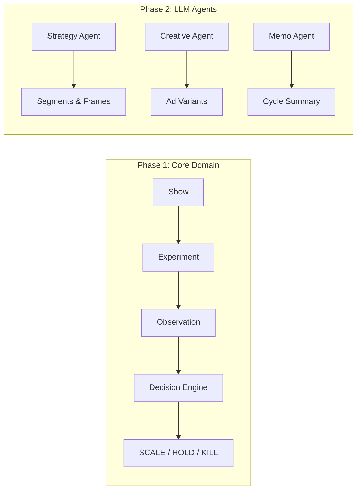

# Bring The People — Agentic Growth System

A multi-agent marketing system for live show producers to run disciplined, data-driven experiments that increase ticket sales. The system uses LLM agents for strategy generation and creative ideation, paired with a deterministic decision engine that applies Scale/Hold/Kill rules based on experimental evidence.

---

## Overview

**Purpose**: Enable solo live-show producers to run small-budget marketing experiments with fast feedback loops, producing repeatable, logged decisions.

**Core Workflow**:

1. **Producer** creates a show with venue, date, and capacity details
2. **Strategy Agent** (Claude, tool-use) analyzes the show and proposes audience segments and framing hypotheses
3. **Creative Agent** (Claude, tool-use) generates ad copy variants for each hypothesis
4. **Producer** reviews and approves experiments via the dashboard
5. **Producer** manually runs ads using system output (copy, UTMs, targeting specs)
6. **Producer** inputs observation data (spend, clicks, purchases) back into the system
7. **Decision Engine** applies deterministic Scale/Hold/Kill rules
8. **Memo Agent** (Claude) summarizes cycle learnings for the producer
9. **Knowledge base** captures what worked and failed, feeding the next cycle



---

## Architecture

### Hexagonal Architecture

The codebase follows **Hexagonal (Ports and Adapters)** architecture:

```
src/growth/
├── domain/          # Pure business logic (no external dependencies)
│   ├── models.py    # Frozen dataclasses: Show, Experiment, Observation, Decision
│   ├── policies.py  # Deterministic Scale/Hold/Kill rules
│   ├── events.py    # Domain events for audit trail
│   └── policy_config.py  # Threshold configuration from TOML
├── ports/           # Protocols/interfaces (dependency inversion)
│   ├── repositories.py   # Repository ports for persistence
│   └── event_log.py      # Event log protocol
├── adapters/        # Concrete implementations of ports
│   ├── orm.py       # SQLAlchemy ORM models
│   ├── repositories.py   # SQLAlchemy repository implementations
│   ├── event_log.py      # JSONL append-only event log
│   └── llm/         # Claude-powered agents (Phase 2)
└── app/             # Application layer
    ├── api/         # FastAPI routes
    ├── services/    # Application services (orchestration)
    ├── schemas.py   # Pydantic request/response models
    ├── container.py # Dependency injection
    └── cli.py       # CLI smoke test
```

**Key Principles**:
- **Domain is pure** — [`policies.py`](src/growth/domain/policies.py) contains only plain functions operating on domain models. No LLM, no DB, no IO.
- **Ports are Python Protocols** — each port defines a contract; adapters implement it; the container wires them together.
- **LLM adapters are constrained** — Agent outputs are parsed into Pydantic models with validation. Invalid outputs are rejected and logged.
- **The API layer is thin** — FastAPI routes call application services. Routes handle HTTP concerns only.

---

## Domain Model

### Core Entities

| Entity | Description | Key Fields |
|--------|-------------|------------|
| [`Show`](src/growth/domain/models.py:46) | A live performance event | artist, city, venue, show_time, capacity, tickets_sold |
| [`AudienceSegment`](src/growth/domain/models.py:60) | Target audience definition | name, definition_json (targeting criteria), estimated_size |
| [`CreativeFrame`](src/growth/domain/models.py:70) | Framing hypothesis for a segment | hypothesis, promise, evidence_refs, risk_notes |
| [`CreativeVariant`](src/growth/domain/models.py:82) | Ad copy variant generated by Creative Agent | platform, hook, body, cta, constraints_passed |
| [`Experiment`](src/growth/domain/models.py:92) | A marketing experiment running a frame | channel, objective, budget_cap_cents, status |
| [`Observation`](src/growth/domain/models.py:107) | Time-windowed metrics for an experiment | spend, clicks, purchases, revenue, refunds |
| [`Decision`](src/growth/domain/models.py:128) | Evaluation outcome for an experiment | action (scale/hold/kill), confidence, rationale |
| [`ProducerMemo`](src/growth/domain/models.py:140) | Cycle summary generated by Memo Agent | cycle_start, cycle_end, markdown |

### State Machines

**Experiment Status Flow**:
```
draft → awaiting_approval → approved → running → completed
  ↑___________________________________________↓
                        stopped / archived
```

**Decision Actions**:
- `SCALE` — Increase budget, expand to similar segments
- `HOLD` — Maintain current spend, gather more evidence
- `KILL` — Stop experiment, document learnings

---

## Decision Engine

The decision engine in [`policies.py`](src/growth/domain/policies.py) is deterministic and hierarchical:

```python
# Decision hierarchy (highest priority first)
def evaluate(...):
    # 1. Guardrails - if violated, KILL immediately
    # 2. Kill conditions - if triggered, KILL
    # 3. Evidence minimums - if not met, HOLD
    # 4. Scale conditions - if met, SCALE; else HOLD
```

### Guardrails (Immediate Kill)

| Metric | Threshold | Meaning |
|--------|-----------|---------|
| Refund rate | ≤10% | Too many refunds indicates targeting mismatch |
| Complaint rate | ≤5% | Brand safety threshold |
| Negative comment rate | ≤15% | Social sentiment guardrail |

### Evidence Minimums

Before making a scale decision, the experiment must have:
- **2+ observation windows** (days of data)
- **150+ clicks** (enough traffic to judge)
- **5+ purchases** (conversion signal)

### Scale Conditions

An experiment scales when:
- Incremental tickets per $100 > 0
- CAC ≤ 85% of baseline CAC

### Confidence Scoring

```python
confidence = (
    sample_score * 0.4 +      # Meets evidence minimums
    lift_score * 0.4 +        # Performance vs baseline
    consistency_score * 0.2   # Window-to-window stability
)
```

Configuration in [`config/policy.toml`](config/policy.toml).

---

## API

### FastAPI Application

```bash
# Start the server
uv run python -m uvicorn growth.app.main:app --reload

# Health check
curl http://localhost:8000/health
```

### Endpoints

| Method | Endpoint | Description |
|--------|----------|-------------|
| `POST` | `/api/shows` | Create a show |
| `GET` | `/api/shows` | List all shows |
| `GET` | `/api/shows/{id}` | Get show details |
| `PATCH` | `/api/shows/{id}` | Update show |
| `POST` | `/api/experiments` | Create experiment |
| `GET` | `/api/experiments?show_id={id}` | List show experiments |
| `POST` | `/api/experiments/{id}/submit` | Submit for approval |
| `POST` | `/api/experiments/{id}/approve` | Approve/reject experiment |
| `POST` | `/api/experiments/{id}/start` | Start running experiment |
| `POST` | `/api/observations` | Add observation window |
| `POST` | `/api/observations/bulk` | Bulk add observations |
| `GET` | `/api/observations?experiment_id={id}` | List observations |
| `POST` | `/api/decisions/evaluate/{id}` | Evaluate experiment |
| `GET` | `/api/decisions?experiment_id={id}` | List decisions |

### Running Experiments

```bash
# 1. Create a show
curl -X POST http://localhost:8000/api/shows \
  -H "Content-Type: application/json" \
  -d '{
    "artist_name": "Test Artist",
    "city": "Austin",
    "venue": "The Parish",
    "show_time": "2026-05-01T20:00:00Z",
    "timezone": "America/Chicago",
    "capacity": 200,
    "tickets_total": 200,
    "tickets_sold": 0
  }'

# 2. Create an experiment (returns experiment_id)
curl -X POST http://localhost:8000/api/experiments \
  -H "Content-Type: application/json" \
  -d '{
    "show_id": "<show-id>",
    "segment_id": "<segment-id>",
    "frame_id": "<frame-id>",
    "channel": "meta",
    "objective": "ticket_sales",
    "budget_cap_cents": 5000,
    "baseline_snapshot": {"cac_cents": 800, "conversion_rate": 0.02}
  }'

# 3. Submit for approval
curl -X POST http://localhost:8000/api/experiments/<exp-id>/submit

# 4. Approve
curl -X POST http://localhost:8000/api/experiments/<exp-id>/approve \
  -H "Content-Type: application/json" \
  -d '{"approved": true}'

# 5. Start
curl -X POST http://localhost:8000/api/experiments/<exp-id>/start

# 6. Add observations
curl -X POST http://localhost:8000/api/observations \
  -H "Content-Type: application/json" \
  -d '{
    "experiment_id": "<exp-id>",
    "window_start": "2026-04-01T00:00:00Z",
    "window_end": "2026-04-02T00:00:00Z",
    "spend_cents": 2500,
    "impressions": 10000,
    "clicks": 200,
    "sessions": 180,
    "checkouts": 20,
    "purchases": 8,
    "revenue_cents": 32000
  }'

# 7. Evaluate
curl -X POST http://localhost:8000/api/decisions/evaluate/<exp-id>
```

---

## Strategy Agent (Phase 2)

The Strategy Agent is a Claude-powered LLM agent that analyzes a show and proposes audience segments with framing hypotheses for the next experiment cycle.

### Agent Loop

```python
# agent_runner.run() implements the tool-use loop
while turns < max_turns:
    response = claude.chat(messages, tools=available_tools)
    if response has tool_use blocks:
        dispatch each tool, append results
    else:
        parse response as StrategyOutput
        return AgentResult
```

### Tools Available to Strategy Agent

| Tool | Purpose | Returns |
|------|---------|---------|
| `get_show_details` | Current ticket sales, show phase | Show metadata + computed phase |
| `get_budget_status` | Remaining budget, phase caps | Spend, remaining, max per experiment |
| `get_active_experiments` | What's already running | Segments, hypotheses, channels |
| `query_knowledge_base` | Past experiments by city/genre | Outcomes, decisions, metrics |

### Output Schema

```python
class FramePlan(BaseModel):
    segment_name: str
    segment_definition: dict  # targeting criteria
    estimated_size: int | None
    hypothesis: str           # framing angle
    promise: str              # value proposition
    evidence_refs: list[EvidenceRef]  # citations required
    channels: list[str]       # e.g., ["meta", "instagram"]
    budget_range_cents: tuple[int, int]
    risk_notes: str | None

class StrategyOutput(BaseModel):
    frame_plans: list[FramePlan] = Field(min_length=3, max_length=5)
    reasoning_summary: str
```

### Running the Strategy Agent

```bash
# Trigger a strategy run for a show
curl -X POST http://localhost:8000/api/strategy/{show_id}/run

# Response includes:
{
  "run_id": "uuid",
  "segment_ids": ["uuid", ...],
  "frame_ids": ["uuid", ...],
  "reasoning_summary": "string",
  "turns_used": 7,
  "total_input_tokens": 4500,
  "total_output_tokens": 1200
}
```

Artifacts are written to `data/runs/{run_id}/`:
- `strategy_conversation.jsonl` — Full agent conversation log
- `plan.json` — Parsed StrategyOutput with metadata

---

## Configuration

### Policy Configuration

[`config/policy.toml`](config/policy.toml) contains tunable thresholds:

```toml
[evidence_minimums]
min_windows = 2
min_clicks = 150
min_purchases = 5

[scale_thresholds]
min_incremental_tickets_per_100usd = 0.0
max_cac_vs_baseline_ratio = 0.85

[guardrails]
max_refund_rate = 0.10
max_complaint_rate = 0.05
max_negative_comment_rate = 0.15
```

### Environment Variables

```bash
# Required for Strategy Agent
ANTHROPIC_API_KEY=sk-ant-...

# Optional (defaults shown)
DATABASE_URL=sqlite:///growth.db
EVENT_LOG_PATH=data/events.jsonl
POLICY_CONFIG_PATH=config/policy.toml
```

---

## Development

### Setup

```bash
# Create virtual environment
python -m venv .venv
source .venv/bin/activate  # or .venv\Scripts\activate on Windows

# Install with dev dependencies
pip install -e ".[dev]"
```

### Testing

```bash
# Run all tests
pytest -v

# Run with coverage
pytest --cov=growth --cov-report=html

# Run specific test file
pytest tests/domain/test_policies.py -v

# Run smoke test (CLI)
python -m growth.app.cli --cleanup
```

### CLI Smoke Test

```bash
# Run full system test
python -m growth.app.cli

# Cleanup files after
python -m growth.app.cli --cleanup
```

The smoke test exercises:
1. Database and event log setup
2. Show creation
3. Experiment creation
4. Observation recording
5. Decision evaluation
6. Event log read-back

---

## Project Structure

```
bring-the-people/
├── config/
│   └── policy.toml              # Decision thresholds
├── docs/
│   ├── designs/                 # Architecture decisions
│   │   ├── high-level-design.md
│   │   └── phase2-llm-agents.md
│   └── plans/                   # Implementation plans
│       └── 2026-02-23-phase2-strategy-agent.md
├── src/growth/
│   ├── domain/
│   │   ├── models.py            # Core entities (frozen dataclasses)
│   │   ├── policies.py          # Decision engine
│   │   ├── events.py            # Domain events
│   │   └── policy_config.py     # TOML config loader
│   ├── ports/
│   │   ├── repositories.py      # Repository protocols
│   │   └── event_log.py         # Event log protocol
│   ├── adapters/
│   │   ├── orm.py               # SQLAlchemy models
│   │   ├── repositories.py      # SQLAlchemy implementations
│   │   ├── event_log.py         # JSONL event log
│   │   └── llm/                 # Phase 2: LLM agents
│   │       ├── client.py        # Claude client wrapper
│   │       ├── agent_runner.py  # Tool-use loop
│   │       ├── errors.py        # Agent exceptions
│   │       ├── result.py        # AgentResult dataclass
│   │       ├── schemas.py       # StrategyOutput model
│   │       ├── prompts/
│   │       │   └── strategy.py  # System prompt
│   │       └── strategy_tools.py # Agent tools
│   └── app/
│       ├── api/
│       │   ├── app.py           # FastAPI factory
│       │   ├── shows.py         # Show routes
│       │   ├── experiments.py   # Experiment routes
│       │   ├── observations.py  # Observation routes
│       │   ├── decisions.py     # Decision routes
│       │   └── strategy.py      # Strategy agent route
│       ├── services/
│       │   ├── decision_service.py  # Decision orchestration
│       │   └── strategy_service.py  # Strategy agent orchestration
│       ├── schemas.py           # Pydantic models
│       ├── container.py         # Dependency injection
│       ├── cli.py               # Smoke test CLI
│       └── main.py              # Uvicorn entry point
└── tests/
    ├── domain/                  # Unit tests for domain
    ├── adapters/                # Adapter tests
    ├── api/                     # API integration tests
    └── app/                     # Service tests
```

---

## Key Design Decisions

1. **Frozen Dataclasses for Domain Models** — Immutability prevents accidental mutation; forces explicit updates via copy.

2. **Protocols over Abstract Base Classes** — Python's `Protocol` enables structural subtyping; adapters don't need to inherit.

3. **Append-Only JSONL Event Log** — Audit trail is separate from operational database. Events are immutable facts.

4. **Deterministic Decision Rules First** — The system prefers reproducible rules over opaque model decisions for gating spend.

5. **Human-in-the-Loop for Spend** — The producer must approve experiments before they run. Full autonomy is a non-goal.

6. **No Framework for Agents** — Direct Anthropic SDK with a simple function-based runner. No LangChain/crewAI abstractions.

---

## License

See [LICENSE](LICENSE).
