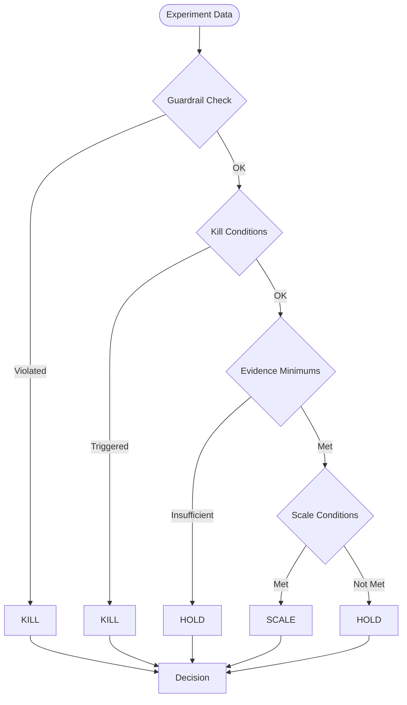

# Architecture: Decision Engine

The Decision Engine is the deterministic heart of the growth system. It evaluates marketing experiments based on observation data and produces SCALE, HOLD, or KILL decisions with confidence scores.

---

## Core Philosophy

> **Deterministic rules over opaque model decisions.**

The engine uses pure functions operating on domain models. No LLM involvement, no database queries, no external IO. This makes decisions:
- **Reproducible** — Same inputs always produce same outputs
- **Testable** — Pure functions are easy to unit test
- **Auditable** — Rationale is explicit in code, not hidden in model weights
- **Fast** — No network calls, sub-millisecond evaluation

---

## Decision Hierarchy

The [`evaluate()`](src/growth/domain/policies.py:128) function applies rules in strict priority order:



### 1. Guardrails (Highest Priority)

Immediate KILL if any threshold exceeded:

```python
if refund_rate > 0.10:        # 10% max refund rate
    return KILL
if complaint_rate > 0.05:     # 5% max complaint rate
    return KILL
if negative_comment_rate > 0.15:  # 15% max negative rate
    return KILL
```

**Rationale**: Brand safety and customer satisfaction take precedence over performance metrics.

### 2. Kill Conditions

KILL if the experiment is clearly underperforming:

```python
# Budget exhausted with zero purchases
if spend_cents >= budget_cap and total_purchases == 0:
    return KILL

# Conversion rate below 50% of baseline (with enough clicks)
if clicks >= min_clicks:
    threshold = baseline_conversion_rate * 0.50
    if conversion_rate < threshold:
        return KILL
```

### 3. Evidence Minimums

HOLD if we don't have enough data to make a confident decision:

```python
if num_windows < 2:       # Need at least 2 days of data
    return HOLD
if total_clicks < 150:    # Need statistically meaningful traffic
    return HOLD
if total_purchases < 5:   # Need some conversion signal
    return HOLD
```

### 4. Scale Conditions

SCALE only if performance exceeds thresholds:

```python
# Must have incremental tickets
if incremental_tickets_per_100usd <= 0:
    return HOLD

# CAC must be better than baseline
max_cac = baseline_cac_cents * 0.85  # 15% better
if cac_cents > max_cac:
    return HOLD

return SCALE
```

---

## Confidence Scoring

When scaling, the confidence score reflects data quality and performance lift:

```python
confidence = (
    sample_score * 0.4 +      # How well we meet minimums
    lift_score * 0.4 +        # Performance vs baseline
    consistency_score * 0.2   # Window-to-window stability
)
```

### Sample Score

```python
window_ratio = min(num_windows / min_windows, 2.0) / 2.0
click_ratio = min(total_clicks / min_clicks, 2.0) / 2.0
purchase_ratio = min(total_purchases / min_purchases, 2.0) / 2.0
sample_score = (window_ratio + click_ratio + purchase_ratio) / 3.0
```

Rationale: Diminishing returns after 2x minimums. Rewards gathering more data without requiring it.

### Lift Score

```python
if baseline_cac_cents > 0:
    lift_ratio = max(0, 1.0 - (cac_cents / baseline_cac_cents))
else:
    lift_ratio = 0.0
lift_score = min(lift_ratio * 2, 1.0)
```

Rationale: 50% improvement (CAC half of baseline) gives full score. Linear scaling below that.

### Consistency Score

```python
consistency_score = min(num_windows / (min_windows * 2), 1.0)
```

Rationale: More windows = more consistent signal. Capped at 2x minimums.

---

## Configuration

All thresholds are externalized to [`config/policy.toml`](config/policy.toml):

```toml
[evidence_minimums]
min_windows = 2
min_clicks = 150
min_purchases = 5

[scale_thresholds]
min_incremental_tickets_per_100usd = 0.0
max_cac_vs_baseline_ratio = 0.85

[kill_thresholds]
min_conversion_rate_vs_baseline_ratio = 0.50

[guardrails]
max_refund_rate = 0.10
max_complaint_rate = 0.05
max_negative_comment_rate = 0.15

[confidence_weights]
sample_sufficiency = 0.4
lift_strength = 0.4
window_consistency = 0.2
```

### Adjusting Thresholds

- **Lower `min_clicks`** for faster decisions on low-traffic channels
- **Raise `max_cac_vs_baseline_ratio`** to be more aggressive with scaling
- **Lower guardrail thresholds** for stricter brand safety
- **Adjust confidence weights** to prioritize different data aspects

Changes take effect on next deployment (config loaded at startup).

---

## Metrics Aggregation

The [`DecisionService`](src/growth/app/services/decision_service.py:19) aggregates observations before calling `evaluate()`:

```python
metrics = {
    "total_spend_cents": sum(o.spend_cents for o in observations),
    "total_clicks": sum(o.clicks for o in observations),
    "total_purchases": sum(o.purchases for o in observations),
    "total_refunds": sum(o.refunds for o in observations),
    ...
}
```

Derived metrics:

```python
conversion_rate = total_purchases / total_clicks
cac_cents = spend_cents // total_purchases
refund_rate = total_refunds / total_purchases
```

---

## Decision Persistence

Decisions are:

1. **Saved to database** via `ExperimentRepository.save_decision()`
2. **Logged as domain events** via `EventLog.append(DecisionRecorded(...))`

The [`Decision`](src/growth/domain/models.py:128) model captures:
- `decision_id`: Unique identifier
- `experiment_id`: Link to experiment
- `action`: SCALE, HOLD, or KILL
- `confidence`: 0.0-1.0 score
- `rationale`: Human-readable explanation
- `policy_version`: Version of policy rules used
- `metrics_snapshot`: Key metrics at decision time

---

## Testing

The decision engine has extensive tests in [`tests/domain/test_policies.py`](tests/domain/test_policies.py):

```python
def test_guardrails_kill_on_high_refund_rate():
    """Refund rate above threshold should KILL."""
    result = check_guardrails(
        refund_rate=0.15,  # Above 10% threshold
        complaint_rate=0.01,
        negative_comment_rate=0.05,
        max_refund_rate=0.10,
        max_complaint_rate=0.05,
        max_negative_comment_rate=0.15,
    )
    assert result == DecisionAction.KILL
```

### Property-Based Testing

Good tests to add:
- Guardrails are all-or-nothing (any violation = KILL)
- Evidence minimums are monotonic (more data never hurts)
- Confidence is bounded [0, 1]
- Same inputs produce same outputs (determinism)

---

## Future Enhancements

### Phase 3 Ideas

1. **Multi-Armed Bandit** — Bayesian updating for exploration/exploitation tradeoff
2. **Cohort Analysis** — Segment decisions by audience characteristics
3. **Seasonality Adjustment** — Normalize for day-of-week effects
4. **Statistical Significance** — Add p-values for conversion rate comparisons
5. **Dynamic Thresholds** — Adjust based on show phase or genre

### Non-Goals

- **LLM-based decisions** — Keep the engine deterministic
- **Real-time streaming** — Batch observations are sufficient
- **Complex ML models** — Simplicity and interpretability over accuracy

---

## Related Files

- [`src/growth/domain/policies.py`](src/growth/domain/policies.py) — Core rules
- [`src/growth/domain/policy_config.py`](src/growth/domain/policy_config.py) — Config loader
- [`src/growth/app/services/decision_service.py`](src/growth/app/services/decision_service.py) — Orchestration
- [`config/policy.toml`](config/policy.toml) — Threshold configuration
- [`tests/domain/test_policies.py`](tests/domain/test_policies.py) — Unit tests
