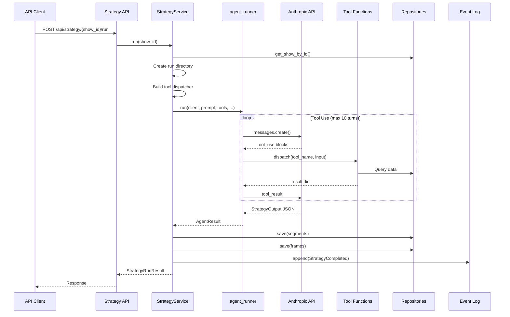

# Architecture: Strategy Agent

The Strategy Agent is a Claude-powered LLM agent that analyzes a show's context and proposes audience segments with framing hypotheses for the next experiment cycle.

---

## Overview



---

## Agent Infrastructure

### Design Principles

1. **No Framework** — Direct Anthropic SDK, not LangChain/crewAI
2. **Normalized Messages** — Always content blocks, never raw strings
3. **Generic Runner** — Same loop for Strategy, Creative, and Memo agents
4. **Explicit Turn Limits** — Prevents runaway costs
5. **Full Logging** — Every message persisted for debugging

### Claude Client

Thin wrapper around `anthropic.Anthropic()`:

```python
class ClaudeClient:
    def chat(
        self,
        messages: list[dict],
        system: str | None = None,
        tools: list[dict] | None = None,
    ) -> Message:
        # Calls messages.create(), returns raw Message
```

Configuration:
- API key from `ANTHROPIC_API_KEY` env var
- Default model: `claude-sonnet-4-20250514` (configurable)

### Agent Runner

The [`run()`](src/growth/adapters/llm/agent_runner.py:15) function implements the tool-use loop:

```python
def run(
    client: ClaudeClient,
    system_prompt: str,
    user_message: str,
    tools: list[dict],
    tool_dispatcher: Callable[[str, dict], dict],
    output_model: type[BaseModel],
    max_turns: int = 10,
    conversation_log_path: Path | None = None,
) -> AgentResult:
```

**Loop Behavior**:

1. Initialize messages with user message
2. Call Claude API
3. If response has `tool_use` blocks:
   - Dispatch each tool call
   - Append tool results to messages
   - Increment turn counter
   - Loop (if under max_turns)
4. If response is text:
   - Parse as JSON into `output_model`
   - On parse error: retry once with feedback
   - On second failure: raise `AgentParseError`

**Message Format** (always normalized):

```python
# User message
{"role": "user", "content": [{"type": "text", "text": "..."}]}

# Assistant with tool_use
{"role": "assistant", "content": [
    {"type": "tool_use", "id": "...", "name": "...", "input": {...}}
]}

# Tool result
{"role": "user", "content": [
    {"type": "tool_result", "tool_use_id": "...", 
     "content": [{"type": "text", "text": "..."}]}
]}
```

### Error Handling

```python
class AgentTurnLimitError(Exception):
    """Exceeded max turns without producing output."""

class AgentParseError(Exception):
    """Failed to parse response as structured output."""

class AgentAPIError(Exception):
    """Underlying LLM API call failed."""
```

On error:
1. Log partial conversation
2. Emit `StrategyFailed` event
3. Raise `StrategyRunError` with run_id
4. API returns 502 with error details

---

## Strategy Agent

### System Prompt

The prompt establishes:
- **Role**: "Growth strategy agent for live show ticket sales"
- **Goal**: "Propose 3-5 experiment frames for the current cycle"
- **Constraints**:
  - Every hypothesis must cite evidence
  - Don't duplicate active experiments
  - Stay within phase budget caps
- **Tool guidance**: "Start with show details and active experiments..."
- **Output format**: JSON matching `StrategyOutput` schema

### Available Tools

#### `get_show_details(show_id)`

Returns show context:
```python
{
    "show_id": "uuid",
    "artist_name": "...",
    "city": "...",
    "venue": "...",
    "show_time": "...",
    "capacity": 200,
    "tickets_sold": 50,
    "tickets_total": 200,
    "show_phase": "early",  # early, mid, late
    "days_until_show": 45,
}
```

#### `get_active_experiments(show_id)`

Returns running/approved experiments to avoid duplication:
```python
{
    "experiments": [
        {
            "experiment_id": "...",
            "segment_name": "...",
            "hypothesis": "...",
            "channel": "meta",
            "status": "running",
        }
    ]
}
```

#### `get_budget_status(show_id)`

Returns budget availability:
```python
{
    "total_budget_cents": 100000,  # Show-level budget
    "spent_cents": 25000,
    "remaining_cents": 75000,
    "phase": "early",
    "phase_max_pct": 0.10,  # 10% cap per experiment in discovery
    "max_experiment_budget_cents": 10000,
}
```

#### `query_knowledge_base(show_id, filters)`

Returns relevant past experiments:
```python
{
    "experiments": [
        {
            "experiment_id": "...",
            "city": "Austin",
            "segment_name": "...",
            "hypothesis": "...",
            "channel": "meta",
            "decision": "scale",  # or hold, kill
            "cac_cents": 750,
            "conversion_rate": 0.025,
        }
    ]
}
```

Filters support: `city`, `channel`, `decision`, `date_range`

### Output Schema

```python
class EvidenceRef(BaseModel):
    source: str       # "past_experiment", "show_data", "budget_data"
    id: str | None    # Reference ID
    summary: str      # One-line description

class FramePlan(BaseModel):
    segment_name: str
    segment_definition: dict[str, Any]   # Targeting criteria
    estimated_size: int | None
    hypothesis: str                       # Framing angle
    promise: str                          # Value proposition
    evidence_refs: list[EvidenceRef]      # Required citations
    channels: list[str]                   # e.g., ["meta"]
    budget_range_cents: tuple[int, int]   # (min, max)
    risk_notes: str | None

class StrategyOutput(BaseModel):
    frame_plans: list[FramePlan] = Field(min_length=3, max_length=5)
    reasoning_summary: str
```

Validation:
- Pydantic enforces 3-5 frame plans
- Each plan must have non-empty evidence_refs
- Agent is prompted to stay within budget constraints

---

## Strategy Service

The [`StrategyService`](src/growth/app/services/strategy_service.py:52) orchestrates the full flow:

### Flow

1. **Validate Show**
   ```python
   show = show_repo.get_by_id(show_id)
   if show is None:
       raise ValueError(f"Show {show_id} not found")
   ```

2. **Create Run Directory**
   ```python
   run_id = uuid4()
   run_dir = runs_path / str(run_id)
   run_dir.mkdir(parents=True, exist_ok=True)
   ```

3. **Build Tool Dispatcher**
   ```python
   def dispatch(name: str, input: dict) -> dict:
       if name == "get_show_details":
           return get_show_details(show_id, show_repo)
       elif name == "get_active_experiments":
           return get_active_experiments(show_id, exp_repo, seg_repo, frame_repo)
       # ... etc
   ```

4. **Run Agent**
   ```python
   agent_result = run_agent(
       client=claude_client,
       system_prompt=STRATEGY_SYSTEM_PROMPT,
       user_message=user_message,  # Show context
       tools=STRATEGY_TOOL_SCHEMAS,
       tool_dispatcher=dispatcher,
       output_model=StrategyOutput,
       max_turns=10,
       conversation_log_path=conversation_log,
   )
   ```

5. **Persist Results**
   ```python
   for plan in strategy_output.frame_plans:
       segment = AudienceSegment(...)
       seg_repo.save(segment)
       
       frame = CreativeFrame(...)
       frame_repo.save(frame)
   ```

6. **Write Artifacts**
   ```python
   plan_artifact = {
       **strategy_output.model_dump(),
       "run_id": str(run_id),
       "turns_used": agent_result.turns_used,
       "total_input_tokens": agent_result.total_input_tokens,
       ...
   }
   plan_path.write_text(json.dumps(plan_artifact, indent=2))
   ```

7. **Emit Event**
   ```python
   event_log.append(StrategyCompleted(
       show_id=show_id,
       run_id=run_id,
       num_frame_plans=len(strategy_output.frame_plans),
       segment_ids=tuple(segment_ids),
       frame_ids=tuple(frame_ids),
       ...
   ))
   ```

---

## API Endpoint

### `POST /api/strategy/{show_id}/run`

Triggers a strategy run for a show.

**Request**:
```bash
curl -X POST http://localhost:8000/api/strategy/{show_id}/run
```

**Success Response (200)**:
```json
{
  "run_id": "550e8400-e29b-41d4-a716-446655440000",
  "segment_ids": [
    "550e8400-e29b-41d4-a716-446655440001",
    "550e8400-e29b-41d4-a716-446655440002"
  ],
  "frame_ids": [
    "550e8400-e29b-41d4-a716-446655440003",
    "550e8400-e29b-41d4-a716-446655440004"
  ],
  "reasoning_summary": "Focused on young professionals interested in live music...",
  "turns_used": 7,
  "total_input_tokens": 4500,
  "total_output_tokens": 1200
}
```

**Error Responses**:
- `404` — Show not found
- `502` — Agent failure (LLM error, turn limit, parse failure)

---

## Artifacts

Each run creates artifacts in `data/runs/{run_id}/`:

### `strategy_conversation.jsonl`

Append-only log of the full agent conversation:

```json
{"timestamp": "2026-02-23T17:55:00Z", "role": "user", "content": "Plan the next experiment..."}
{"timestamp": "2026-02-23T17:55:01Z", "role": "assistant", "content": {"type": "tool_use", "name": "get_show_details"}}
{"timestamp": "2026-02-23T17:55:02Z", "role": "tool_result", "content": {"tool_use_id": "...", "result": {...}}}
...
```

### `plan.json`

Parsed StrategyOutput with metadata:

```json
{
  "frame_plans": [...],
  "reasoning_summary": "...",
  "run_id": "...",
  "show_id": "...",
  "turns_used": 7,
  "total_input_tokens": 4500,
  "total_output_tokens": 1200,
  "segment_ids": ["..."],
  "frame_ids": ["..."]
}
```

---

## Container Wiring

```python
class Container:
    def strategy_service(self) -> StrategyService:
        from growth.app.services.strategy_service import StrategyService
        from growth.adapters.llm.client import ClaudeClient
        
        return StrategyService(
            claude_client=ClaudeClient(),
            show_repo=self.show_repo(),
            exp_repo=self.experiment_repo(),
            seg_repo=self.segment_repo(),
            frame_repo=self.frame_repo(),
            event_log=self.event_log(),
            policy=self.policy_config(),
            runs_path=Path("data/runs"),
        )
```

---

## Testing

### Unit Tests

Test individual components:
- Tool functions return correct data shapes
- Dispatcher routes correctly
- Output schema validates/invalidates as expected

### Integration Tests

Test with mocked Claude client:

```python
class FakeClaudeClient:
    def __init__(self, responses):
        self.responses = responses
        
    def chat(self, messages, system=None, tools=None):
        return self.responses.pop(0)

def test_strategy_run_success():
    client = FakeClaudeClient([
        # First response: tool_use
        Message(content=[ToolUseBlock(...)]),
        # Second response: StrategyOutput
        Message(content=[TextBlock(text='{"frame_plans": [...]}')]),
    ])
    
    service = StrategyService(client, ...)
    result = service.run(show_id)
    
    assert len(result.segment_ids) == 3
```

### End-to-End Tests

Requires real Anthropic API key:
- Full tool-use loop
- Real LLM reasoning
- Verify segments/frames are persisted

---

## Cost Management

### Turn Limits

| Agent | Default Max Turns | Reason |
|-------|-------------------|--------|
| Strategy | 10 | Needs research + synthesis |
| Creative | 8 | Less research, more generation |
| Memo | 6 | Simple summarization |

### Token Tracking

Every run logs:
- `total_input_tokens` — Context window usage
- `total_output_tokens` — Generation cost

Monitor via artifacts or events for cost analysis.

### Retry Policy

- Parse failures: 1 retry with corrective feedback
- API errors: No retry (fail fast)
- Turn limits: Hard stop (no partial output)

---

## Future Enhancements

### Phase 3

1. **Creative Agent** — Generate ad copy variants from frames
2. **Memo Writer Agent** — Summarize experiment cycles
3. **Knowledge Base Search** — Vector similarity for similar shows
4. **Budget Optimization** — Multi-show allocation

### Deferred Features

- Token budget enforcement (hard cutoffs)
- Automatic retry on transient failures
- Parallel tool execution
- Streaming responses

---

## Related Files

- [`src/growth/adapters/llm/agent_runner.py`](src/growth/adapters/llm/agent_runner.py) — Tool-use loop
- [`src/growth/adapters/llm/client.py`](src/growth/adapters/llm/client.py) — Claude wrapper
- [`src/growth/app/services/strategy_service.py`](src/growth/app/services/strategy_service.py) — Orchestration
- [`src/growth/app/api/strategy.py`](src/growth/app/api/strategy.py) — API endpoint
- [`docs/designs/phase2-llm-agents.md`](docs/designs/phase2-llm-agents.md) — Design document
