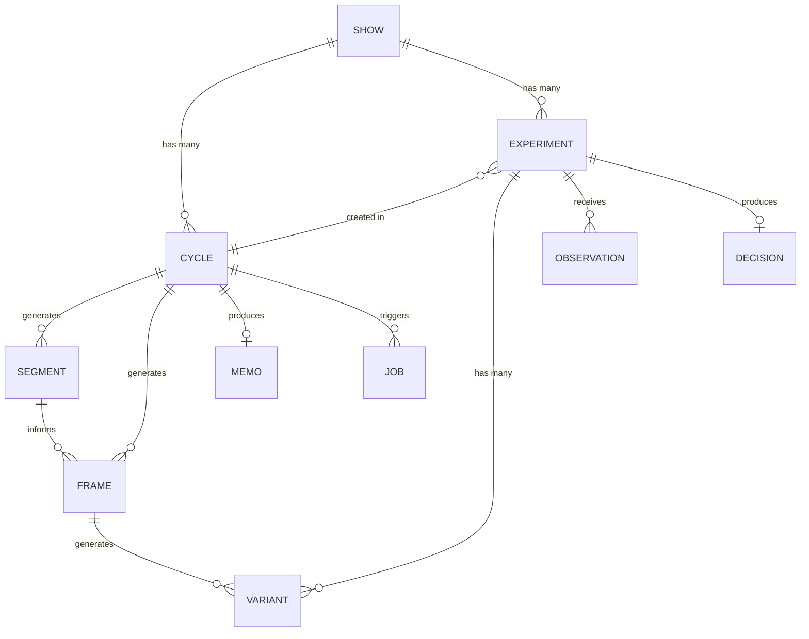
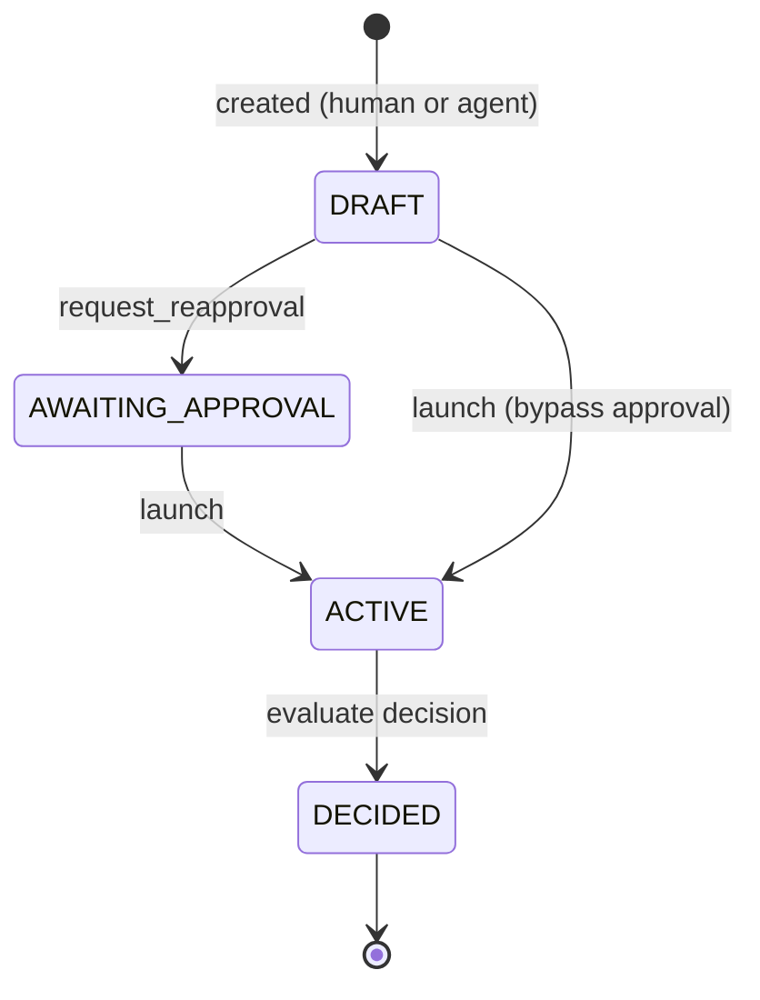
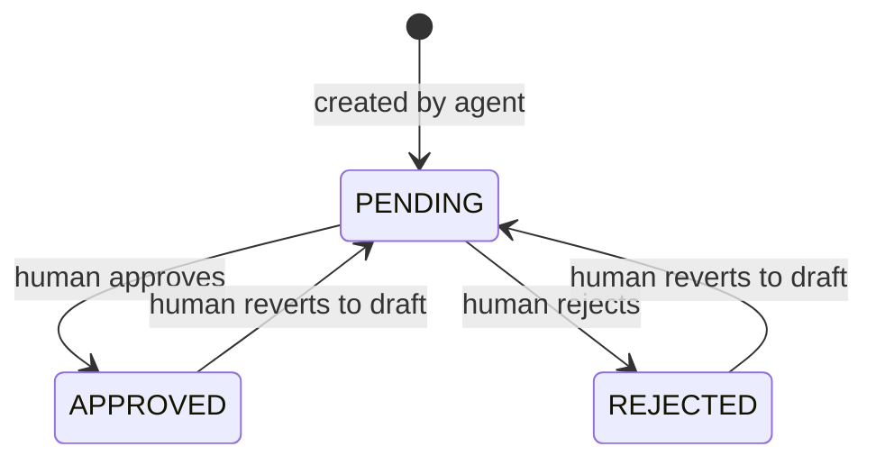
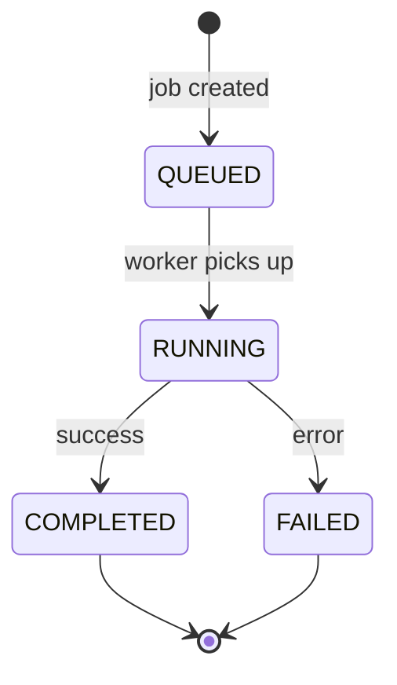
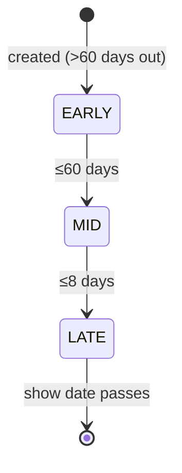
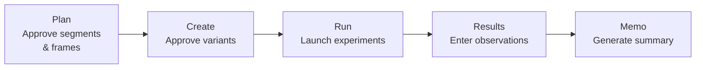
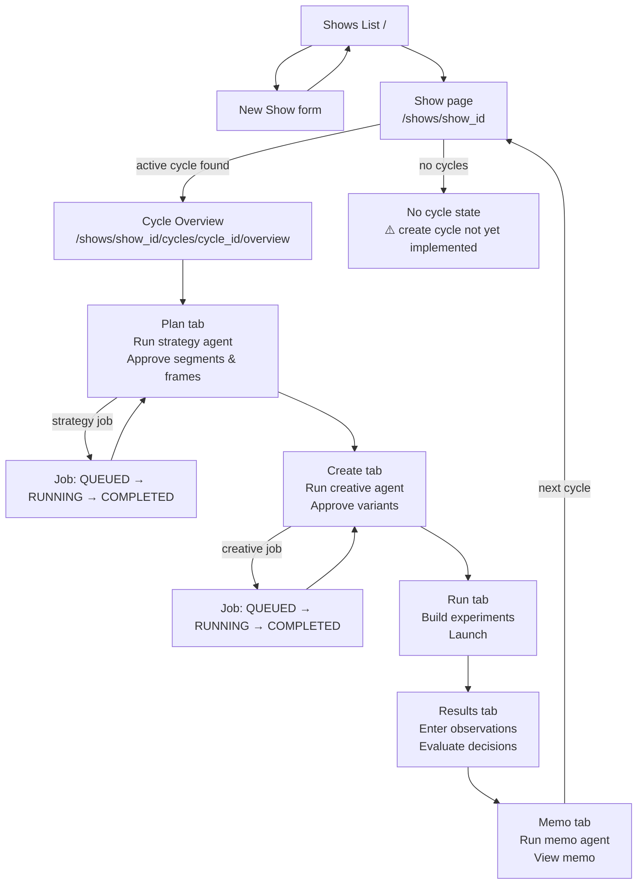
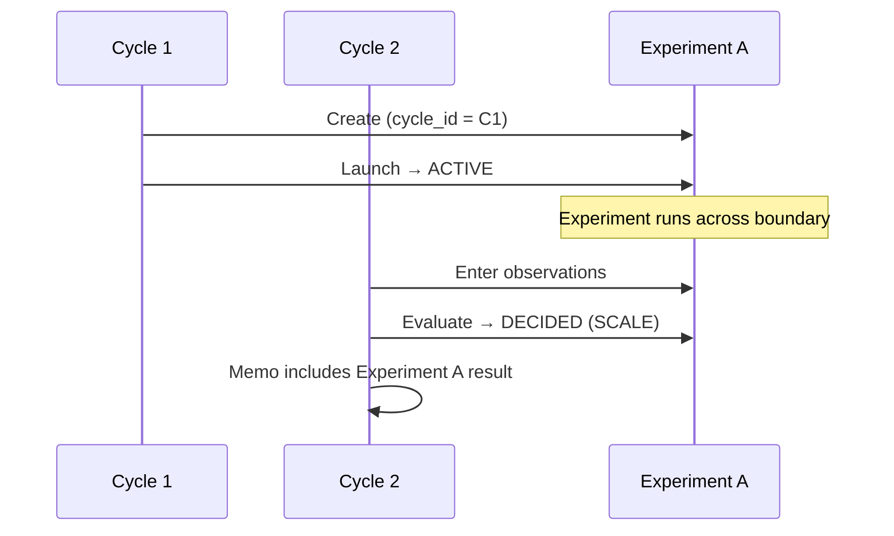
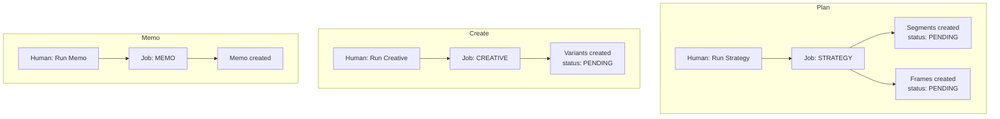

# Entity Lifecycles, Scopes, and User Journeys

Date: 2026-03-04
Status: Living document — open questions flagged inline.

---

## 1. Entity Scope

The system has three levels of scope. Understanding which level each entity belongs to is critical for data fetching, URL design, and workflow gating.

```
Show
├── Cycles (many per show, sequential over time)
│   ├── Segments       — created fresh each cycle by strategy agent
│   ├── Frames         — created fresh each cycle by strategy agent
│   └── Memos          — one per cycle, summarises the cycle
└── Experiments        — show-scoped, cycle-tagged at creation
    ├── Variants       — per experiment, created by creative agent
    ├── Observations   — per experiment, entered by human
    └── Decisions      — per experiment, evaluated by decision engine
```

| Entity      | Scope         | Notes |
|-------------|---------------|-------|
| Show        | root          | Top-level container |
| Cycle       | show          | Multiple per show; sequential marketing sprints |
| Segment     | cycle         | Regenerated by strategy agent each cycle |
| Frame       | cycle         | Regenerated by strategy agent each cycle |
| Experiment  | show (cycle-tagged) | Created in a cycle but **carries over**; `cycle_id` marks origin |
| Variant     | experiment    | Generated by creative agent per frame |
| Observation | experiment    | Human-entered results data |
| Decision    | experiment    | Engine-evaluated outcome (Scale/Hold/Kill) |
| Memo        | cycle         | Summarises the completed cycle |
| Job         | varies        | Strategy/Creative jobs are cycle-scoped; Memo jobs are cycle-scoped |

**Key implication:** Experiments are not confined to a single cycle. An experiment started in cycle 1 may still be running and receiving observations in cycle 2. The `cycle_id` on an experiment records where it was *created*, not where it is currently active.

---

## 2. Entity Relationships



---

## 3. Entity Lifecycles

### 3.1 Experiment Status

Experiments progress through four implemented states. The `launch` endpoint handles two entry points (draft and awaiting re-approval).



| State | Meaning |
|-------|---------|
| `DRAFT` | Created, not yet launched |
| `AWAITING_APPROVAL` | Flagged for human sign-off before launch |
| `ACTIVE` | Live — receiving observations |
| `DECIDED` | Closed — Scale, Hold, or Kill decision recorded |

**Decision actions:** `SCALE` / `HOLD` / `KILL`

> ⚠️ **Gap:** The high-level design describes additional states (`approved`, `running`, `completed`, `stopped`, `archived`) that are not implemented in the current domain model. The implemented set is `DRAFT → ACTIVE → DECIDED`.

---

### 3.2 Review Status (Segments, Frames, Variants)

All three content entities share the same review state machine. Review is a human gate before downstream actions (e.g. cannot generate variants from an unapproved frame).



| State | Meaning |
|-------|---------|
| `PENDING` | Awaiting human review |
| `APPROVED` | Cleared for downstream use |
| `REJECTED` | Excluded from downstream use |

---

### 3.3 Job Status

Jobs are async — Strategy, Creative, and Memo generation all run as background jobs.



Terminal states: `COMPLETED`, `FAILED`. The frontend polls until one of these is reached.

---

### 3.4 Show Phase

Computed from days until showtime. Read-only — not stored.



---

## 4. Cycle Workflow (Per Cycle)

Each cycle runs the same five-phase workflow. The `getCycleProgress()` function derives completion from a snapshot of the cycle's data.



**Completion gates (from `getCycleProgress`):**

| Phase | Complete when… |
|-------|---------------|
| Plan | ≥1 approved segment AND ≥1 approved frame |
| Create | ≥1 approved variant for an approved frame |
| Run | ≥1 experiment with status `active` or `decided` |
| Results | ≥1 observation on a launched experiment |
| Memo | ≥1 memo exists for the cycle |

---

## 5. Full User Journey



---

## 6. Experiment Lifecycle Across Cycles

Because experiments carry over between cycles, the Run and Results tabs on any given cycle show experiments created in *that cycle or earlier*.



> **Open question:** Do segments and frames from cycle 1 carry over to cycle 2, or are they always regenerated fresh? This affects whether the strategy agent has a "starting point" or always starts blank.

---

## 7. Agent-Triggered Flows

Three background agents trigger jobs:



Humans approve/reject output of each agent before the workflow can proceed.

---

## 8. Known Gaps

| Gap | Impact |
|-----|--------|
| No `POST /cycles` endpoint | Cannot create a cycle from the UI — show page dead-ends with no cycles |
| `cycle_id` on Experiment is optional | Possible to create experiments without a cycle association |
| Experiment status set (`DRAFT/ACTIVE/AWAITING_APPROVAL/DECIDED`) diverges from high-level design | Risk of confusion between docs and implementation |
| No cycle history navigation | With multiple cycles per show, there's no UI to switch to a previous cycle |
| `AWAITING_APPROVAL` → `ACTIVE` path is via `launch` (same endpoint as `DRAFT → ACTIVE`) | Approval gate is soft — humans can skip directly to launch from draft |
