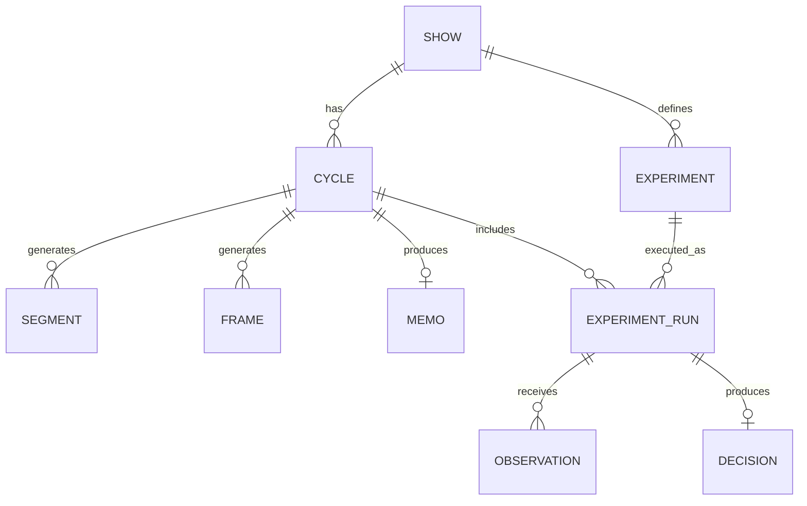

## 1) Final domain model (what you should ship)

### Show

* Container (your campaign)

### Cycle

* Sprint / learning boundary (planning + reporting unit)

### Segment, Frame, Variant

* **Cycle-scoped** content outputs (fresh each cycle)
* Same review status machine as you have

### Experiment (definition)

Show-scoped reusable hypothesis container

**Fields**

* `experiment_id`
* `show_id`
* `origin_cycle_id` (required; where it was first created)
* `segment_id` (FK)
* `frame_id` (FK)
* `channel`
* `objective`
* `budget_cap_cents` (default budget plan)
* `baseline_snapshot`
* (optional) `archived_at`, `tags`, `notes`

✅ No `status`, no `start_time/end_time`, no observations, no decisions.

### ExperimentRun (execution)

Cycle-scoped instance of running an experiment

**Fields**

* `run_id`
* `experiment_id` (FK)
* `cycle_id` (FK)  ← this is the key
* `status`: `draft | awaiting_approval | active | decided`
* `start_time`, `end_time`
* (optional) `budget_cap_cents_override`
* (optional) `variant_ids` selection / snapshot of creative used
* (optional) `channel_config` JSON (targeting, placements, etc.)

✅ Observations + decisions attach to run.

### Observation (per run)

* `observation_id`
* `run_id` (FK)
* window + metrics fields (same as today)
* `raw_json` (keep)

### Decision (per run)

* `decision_id`
* `run_id` (FK)
* action + confidence + rationale + policy_version + metrics_snapshot

---

## 2) What this fixes immediately

### Cycle tabs become true

* **Run tab** shows runs with `cycle_id = this cycle`
* **Results tab** shows observations for those runs
* **Memo** summarizes those runs

### Carry-over becomes explicit

When Cycle 2 starts, you “re-run” an experiment by creating a new `ExperimentRun` in Cycle 2.

No more ambiguity like “this experiment is from cycle 1 but active in cycle 2”.

---

## 3) Updated entity relationship diagram (new truth)

---

## 4) Clean API surface (v1)

### Experiments (definition library)

* `POST /api/experiments` (creates definition, requires `origin_cycle_id`)
* `GET /api/experiments?show_id=`
* `GET /api/experiments/{experiment_id}`

### Runs (cycle truth)

* `POST /api/runs`
  Body: `{ experiment_id, cycle_id, status="draft", ... }`
* `GET /api/runs?cycle_id=`  ✅ **this powers the cycle Run tab**
* `GET /api/runs?experiment_id=` (history)
* `POST /api/runs/{run_id}/request-reapproval`
* `POST /api/runs/{run_id}/launch`
* `POST /api/runs/{run_id}/decide` (or `POST /api/decisions/evaluate/{run_id}`)

### Observations

* `POST /api/observations` (now takes `run_id`, not experiment_id)
* `POST /api/observations/bulk`
* `GET /api/observations?run_id=`

### Metrics

* `GET /api/runs/{run_id}/metrics`
* (optional) `GET /api/experiments/{experiment_id}/metrics` (aggregate across runs)

---

## 5) Status machines (where they belong)

### ExperimentRun status machine (keep yours)

`draft -> awaiting_approval -> active -> decided`

### Experiment status (optional)

You can keep definition-level state very simple:

* `draft | ready | archived`
  …but honestly you can skip this initially and just rely on runs to represent reality.

---

## 6) Frontend query keys (what becomes simple)

You stop pretending experiments are cycle-filterable.

Instead:

* `runKeys.list(cycleId)` → `GET /api/runs?cycle_id=...`
* `observationKeys.list(runId)` → `GET /api/observations?run_id=...`
* `decisionKeys.detail(runId)` (or list) → `GET /api/decisions?run_id=...`

Cycle pages never need to fetch “all show experiments” just to show the Run tab.

---

## 7) What I’d delete/change in your current models (blunt)

### Remove from `Experiment`

* `status`
* `start_time`
* `end_time`

### Make these required FKs (since you can reset DB freely)

* `segment_id` FK → segments
* `frame_id` FK → frames
* `cycle_id` on experiment becomes `origin_cycle_id` and is **required**

---

## 8) Implementation order (fast and clean)

1. Add `experiment_runs` table + ORM + Pydantic schemas
2. Switch observations/decisions to use `run_id` (required)
3. Move launch/request-reapproval/evaluate endpoints to run-based
4. Update frontend Run/Results tabs to be run-driven
5. Update memo generation to summarize runs in cycle
6. Only then decide whether you still want show-level “Experiment library” page
