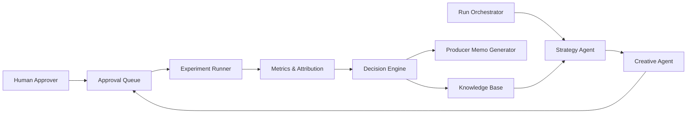

# Spec 07: Agentic Growth System for Live Shows

## Context / Problem

The proposed system needs to increase ticket sales by running disciplined, low-budget experiments on:
- who we target
- how we frame the show
- where we distribute

The core objective is decision automation, not generic marketing automation:
- small bets
- fast feedback
- repeatable, logged decisions

## Goals

- Run weekly/daily experiment cycles with strict budget caps.
- Measure incremental ticket outcomes, not vanity engagement metrics.
- Produce deterministic Scale/Hold/Kill decisions with confidence.
- Keep a full audit trail of hypotheses, creatives, spend, outcomes, and decisions.
- Generate a one-page producer memo after each cycle.

## Non-Goals (MVP)

- Fully autonomous posting/spend without human approval.
- Cross-show media mix optimization across dozens of markets.
- Advanced causal attribution (MMM/MTA) in v1.
- Creative generation without evidence constraints.

## Critiques of the Working Notes and Required Tightening

The original note is directionally right and should be preserved, but these parts must be made explicit:
- Baseline definition is missing. We need a formal baseline by show phase (`T-60..T-30`, `T-29..T-7`, `T-6..T-0`).
- Decision thresholds are unspecified. Scale/Hold/Kill should be rule-based before using model judgment.
- Attribution policy is unspecified. Use last-click UTM as operational truth, plus blended trend sanity checks.
- Sample sufficiency is unspecified. Minimum clicks/purchases/windows are required before scaling.
- Guardrail metrics are missing. Add refunds, complaints, and negative sentiment thresholds.

## Operating Principles

- Human-in-the-loop for spend release and public posting.
- Cheap failures are expected and preferred over slow uncertain tests.
- All decisions must be reproducible from stored artifacts.
- System should prefer deterministic rules over opaque model decisions for gating.

## System Architecture



## Domain Model

Primary entities:
- `Show`
- `Campaign`
- `AudienceSegment`
- `CreativeFrame`
- `CreativeVariant`
- `Experiment`
- `Observation`
- `Decision`
- `ProducerMemo`

### State Machines

Experiment states:
- `draft`
- `awaiting_approval`
- `approved`
- `running`
- `completed`
- `stopped`
- `archived`

Decision states:
- `scale`
- `hold`
- `kill`

## Data Model (Postgres)

```sql
create table shows (
  show_id uuid primary key,
  artist_name text not null,
  city text not null,
  venue text not null,
  show_time timestamptz not null,
  timezone text not null,
  capacity int not null check (capacity > 0),
  tickets_total int not null check (tickets_total >= 0),
  tickets_sold int not null check (tickets_sold >= 0),
  currency text not null default 'USD',
  created_at timestamptz not null default now()
);

create table audience_segments (
  segment_id uuid primary key,
  show_id uuid not null references shows(show_id),
  name text not null,
  definition_json jsonb not null,
  estimated_size int,
  created_by text not null,
  created_at timestamptz not null default now()
);

create table creative_frames (
  frame_id uuid primary key,
  show_id uuid not null references shows(show_id),
  segment_id uuid not null references audience_segments(segment_id),
  hypothesis text not null,
  promise text not null,
  evidence_refs jsonb not null,
  risk_notes text,
  created_at timestamptz not null default now()
);

create table creative_variants (
  variant_id uuid primary key,
  frame_id uuid not null references creative_frames(frame_id),
  platform text not null,
  hook text not null,
  body text not null,
  cta text not null,
  constraints_passed boolean not null default false,
  created_at timestamptz not null default now()
);

create table experiments (
  experiment_id uuid primary key,
  show_id uuid not null references shows(show_id),
  segment_id uuid not null references audience_segments(segment_id),
  frame_id uuid not null references creative_frames(frame_id),
  channel text not null,
  objective text not null,
  budget_cap_cents int not null check (budget_cap_cents > 0),
  status text not null check (status in (
    'draft','awaiting_approval','approved','running','completed','stopped','archived'
  )),
  start_time timestamptz,
  end_time timestamptz,
  baseline_snapshot jsonb not null,
  created_at timestamptz not null default now()
);

create table experiment_variants (
  experiment_id uuid not null references experiments(experiment_id),
  variant_id uuid not null references creative_variants(variant_id),
  is_control boolean not null default false,
  primary key (experiment_id, variant_id)
);

create table observations (
  observation_id uuid primary key,
  experiment_id uuid not null references experiments(experiment_id),
  window_start timestamptz not null,
  window_end timestamptz not null,
  spend_cents int not null default 0,
  impressions int not null default 0,
  clicks int not null default 0,
  sessions int not null default 0,
  checkouts int not null default 0,
  purchases int not null default 0,
  revenue_cents int not null default 0,
  refunds int not null default 0,
  refund_cents int not null default 0,
  complaints int not null default 0,
  negative_comment_rate numeric(6,4),
  attribution_model text not null default 'last_click_utm',
  raw_json jsonb not null,
  created_at timestamptz not null default now()
);

create table decisions (
  decision_id uuid primary key,
  experiment_id uuid not null references experiments(experiment_id),
  action text not null check (action in ('scale','hold','kill')),
  confidence numeric(4,3) not null check (confidence >= 0 and confidence <= 1),
  rationale text not null,
  policy_version text not null,
  metrics_snapshot jsonb not null,
  created_at timestamptz not null default now()
);

create table producer_memos (
  memo_id uuid primary key,
  show_id uuid not null references shows(show_id),
  cycle_start timestamptz not null,
  cycle_end timestamptz not null,
  markdown text not null,
  created_at timestamptz not null default now()
);
```

## Event Contracts

Canonical event names:
- `experiment.created`
- `experiment.approval_requested`
- `experiment.approved`
- `experiment.launched`
- `observation.window_closed`
- `decision.issued`
- `memo.published`

Required envelope fields for all events:
- `event_id`
- `event_type`
- `occurred_at`
- `show_id`
- `experiment_id` (nullable when not applicable)
- `actor` (`system`, `agent`, `human`)
- `payload` (JSON object)

## UTM and Attribution Contract

UTM taxonomy:
- `utm_source`: platform (`meta`, `instagram`, `tiktok`, `email`, `youtube`)
- `utm_medium`: paid/organic format (`paid_social`, `organic_social`, `creator`, `email`)
- `utm_campaign`: `show_{city}_{yyyymmdd}`
- `utm_content`: `exp_{experiment_id}_var_{variant_id}`
- `utm_term`: `segment_{segment_id}`

Attribution v1:
- Operational metric: last-click UTM purchase attribution.
- Sanity check: blended total ticket trend for the same window.
- Decision policy uses operational metric; blended metric can only downgrade confidence.

## Agent and Service Interfaces (Hexagonal Pattern)

New package layout (proposed):
- `src/growth/domain/`
- `src/growth/ports/`
- `src/growth/adapters/`
- `src/growth/app/`

Suggested ports:
- `StrategyPlannerPort.plan(show, history) -> list[FramePlan]`
- `CreativeGeneratorPort.generate(frame_plan, assets) -> list[CreativeVariantDraft]`
- `ApprovalPort.request_approval(experiment_bundle) -> ApprovalResult`
- `CampaignExecutorPort.launch(experiment) -> LaunchResult`
- `ObservationCollectorPort.collect(experiment, window) -> Observation`
- `DecisionPolicyPort.evaluate(experiment, observations, baseline) -> Decision`
- `MemoWriterPort.render(show, cycle_data) -> ProducerMemo`
- `EventLogPort.append(event) -> None`

## Decision Policy (Deterministic v1)

### Metrics

Primary decision metric:
- `incremental_tickets_per_100usd`

Supporting metrics:
- `cac` (cost per acquired ticket)
- `purchase_conversion_rate` (`purchases / clicks`)
- `ticket_velocity_lift` vs baseline

Guardrails:
- `refund_rate`
- `complaint_rate`
- `negative_comment_rate`

### Evidence Minimums

Default minimum evidence before scale:
- at least 2 observation windows
- at least 150 clicks
- at least 5 attributed purchases

If evidence minimums are not met:
- only `hold` or `kill` allowed

### Scale / Hold / Kill Rules

Kill when any of:
- spend reaches budget cap and purchases = 0
- conversion rate < 50% of baseline after minimum click threshold
- any guardrail exceeds hard limit

Scale when all of:
- evidence minimums met
- `incremental_tickets_per_100usd > 0`
- `cac <= baseline_cac * 0.85`
- guardrails within limits

Hold otherwise.

### Confidence Score

`confidence = 0.4 * sample_sufficiency + 0.4 * lift_strength + 0.2 * window_consistency`

Each component normalized to `[0, 1]`.

## Run Cadence and Budget Policy

Cadence by time-to-show:
- `T-60..T-22`: weekly cycle
- `T-21..T-8`: every 48 hours
- `T-7..T-0`: daily cycle with stricter kill thresholds

Budget caps by stage:
- Discovery cycle: max 5-10% of remaining paid budget
- Validation cycle: max 15-20%
- Scale cycle: max 40% to proven winners only

## Human Approval Workflow

Human approval is mandatory before:
- any public creative posting
- any paid spend allocation or cap increase
- any policy override on Scale/Hold/Kill

Approval request payload must include:
- segment definition
- frame hypothesis
- exact creative copy
- channel/budget cap
- expected success and kill criteria

## Producer Memo Contract

Memo sections (single page):
- `What worked` (winner segment/frame/channel with CAC and lift)
- `What failed` (losers and likely failure mode)
- `Cost per seat` and budget efficiency
- `Next 3 tests` (hypothesis, audience, channel, cap, success criteria)
- `Policy exceptions` (if any)

Machine-readable sidecar:
- `memo.json` with top metrics and selected next actions.

## Observability and Artifacts

Per-run artifacts directory (proposed):
- `growth/runs/<run_id>/plan.json`
- `growth/runs/<run_id>/approvals.jsonl`
- `growth/runs/<run_id>/observations.jsonl`
- `growth/runs/<run_id>/decision.json`
- `growth/runs/<run_id>/memo.md`

All pipeline stages must emit timing and metadata, mirroring current trace conventions used by the RAG pipeline.

## Reuse Analysis: What Can Be Reused from This Repo

Directly reusable patterns/components:
- Hexagonal architecture + dependency wiring pattern from `src/rag/app/container.py`.
- Protocol-first interfaces with metadata threading from `src/rag/ports/`.
- Frozen dataclass domain style from `src/rag/domain/models.py`.
- Orchestrated stage runner with per-stage timings from `src/rag/app/query_runner.py`.
- JSONL append logger with optional redaction from `src/rag/adapters/logging/jsonl_logger.py`.
- Threshold-based gate engine from `src/rag/eval/verdict.py`.
- Config-driven threshold loading from `src/rag/eval/verdict_thresholds.py`.
- Run persistence + comparison/trend services from `eval/app/results/services/`.

Reusable with minor adaptation:
- Eval artifact model and run metadata structures in `src/rag/eval/models.py`.
- JSONL persistence adapters in `src/rag/adapters/eval_persistence/jsonl_eval_store.py`.
- Results explorer architecture in `eval/app/results/` for growth run dashboards.

Not reusable (domain mismatch):
- RAG retrieval/chunking/vector-store adapters under `src/rag/adapters/retrieval/`, `src/rag/adapters/chunking/`, and `src/rag/adapters/vectorstores/`.

## Proposed Repository Changes (Incremental)

1. Add `src/growth/` with domain, ports, adapters, app container.
2. Add `growth/scripts/run_cycle.py` and `growth/scripts/decision.py`.
3. Add `growth/policies/default.toml` for thresholds and guardrails.
4. Add `growth/runs/` artifact format plus optional Streamlit viewer.
5. Add `docs/specs/` follow-up implementation plan + runbook.

## Test Strategy

Unit tests:
- decision policy thresholds
- confidence scoring
- attribution parsing from UTM
- budget cap enforcement
- state transition guards

Integration tests:
- full run cycle: strategy -> creative -> approval -> execution -> observation -> decision -> memo
- replay determinism from stored artifacts
- policy override auditing

Simulation tests:
- synthetic outcomes to validate scale/kill behavior under noise
- edge case: low-traffic shows with sparse conversions

## Acceptance Criteria

- [ ] Every experiment has explicit success and kill criteria before launch.
- [ ] No spend/public posting occurs without recorded approval artifact.
- [ ] Each completed cycle emits `decision.json` and `memo.md`.
- [ ] Decision output is reproducible from persisted observations.
- [ ] Baseline and lift are computed with phase-aware windows.
- [ ] Guardrail violations force `kill` regardless of engagement metrics.
- [ ] Re-run on same artifacts yields same Scale/Hold/Kill decision.

## Risks and Mitigations

| Risk | Mitigation |
|------|------------|
| Low sample sizes lead to noisy decisions | Enforce minimum evidence and default to Hold |
| Attribution blind spots (cross-device, delayed purchase) | Use last-click operationally plus blended trend sanity check |
| Creative drift from show reality | Require evidence refs and testimonial alignment checks |
| Over-optimizing one city/show type | Track repeatability by city and preserve exploration budget |
| Human bottleneck on approvals | Batch approvals by cycle with capped pending queue |

## Rollout Plan

Phase 0 (1 week):
- Implement data contracts, run artifacts, and manual observation ingest.

Phase 1 (1-2 weeks):
- Implement deterministic decision engine + memo generator with manual creative input.

Phase 2 (2-3 weeks):
- Add Strategy/Creative agents constrained by templates and evidence checks.

Phase 3 (2 weeks):
- Add dashboard for run comparison and trend tracking.

Phase 4:
- Add adaptive budget allocator (bandit policy) only after stable baseline performance.

## Open Questions

- Which channels are in MVP scope (`Meta`, `Instagram`, `TikTok`, `Email`, etc.)?
- What is the authoritative ticketing source for purchase events?
- What is acceptable conversion lag window (same-day, 7-day click, 24-hour view)?
- Which guardrail thresholds are business-approved for refunds and complaints?
