# Phase 3: Next.js Dashboard — Implementation Plan

## Decisions

| Decision | Choice | Rationale |
|----------|--------|-----------|
| Segment/frame/variant approval | Persisted in backend — `approval_status: draft/approved/rejected` enum + `reviewed_at` + `reviewed_by` | Auditable; reversible; avoids `approved=false` ambiguity |
| Agent run execution model | Async jobs — in-process worker loop polling `background_jobs` table from startup (`status: queued/running/completed/failed`) | Restart-safe; clean upgrade path to real queue; same frontend contract |
| Job polling backoff | 2s → 4s → 8s after 20s; server returns `updated_at` so UI can show "still working" | Avoids chatty polling when multiple creative jobs run concurrently |
| Cycle grouping | `cycle_id` on segments, frames, variants, experiments, observations, memos | Required for "history preserved" + correct stepper state — add before frontend pages |
| Computed metrics | Backend returns canonical metrics too (not frontend-only) | Avoids rounding mismatches between Overview and Results views |
| Ticket base URL | Per-show field `ticket_base_url` on `Show` model | Makes experiments reproducible; Settings page can default it, show can override |
| Frontend data fetching | TanStack Query everywhere; RSC/SSR only for shell + initial show load | Avoids split mental model between RSC patterns and Query patterns |
| Knowledge Base page | Deferred to Phase 4 | High effort; not on the critical path |


## Overview

Phase 3 delivers the Next.js dashboard that lets the producer manage the full growth cycle through a web UI. The backend API (Phases 0–2) is complete. This plan covers the frontend application only.

**Source of truth for UX intent**: [`docs/designs/dashboard-prototype.html`](../designs/dashboard-prototype.html) and [`docs/designs/dashboard.md`](../designs/dashboard.md).

---

## Tech Stack

| Layer | Choice | Rationale |
|---|---|---|
| Framework | Next.js 14+ App Router | SSR for initial loads, RSC for data fetching, matches existing stack intention |
| UI components | shadcn/ui | Already specified in design doc; accessible, unstyled primitives |
| Styling | Tailwind CSS | Matches prototype; design tokens already defined in prototype |
| API client | TanStack Query + auto-generated from OpenAPI | Backend serves OpenAPI at `/docs`; TanStack Query for cache and async state |
| Forms | React Hook Form + Zod | Type-safe forms, mirrors Pydantic validation on backend |
| Markdown rendering | react-markdown | Memo tab renders producer memo markdown |
| Charts | Recharts | Lightweight, composable; for CAC/velocity sparklines |

---

## Repository Layout

```
frontend/
  app/
    layout.tsx                  # AppShell: sidebar + main content wrapper
    page.tsx                    # Redirect to /shows
    shows/
      page.tsx                  # Shows list
      new/
        page.tsx                # Create show form
      [show_id]/
        layout.tsx              # ShowHeader + CycleStepper tabs
        page.tsx                # Redirect to overview
        overview/
          page.tsx              # Show overview: KPIs, next action, activity feed
        plan/
          page.tsx              # Strategy tab: run agent, approve segments/frames
        create/
          page.tsx              # Creative tab: run agent per frame, approve variants
        run/
          page.tsx              # Experiments tab: builder, UTMs, launch toggle
        results/
          page.tsx              # Results entry per experiment, trigger decisions
        memo/
          page.tsx              # Memo tab: generate + rendered memo
  components/
    layout/
      Sidebar.tsx
      ShowHeader.tsx
      CycleStepper.tsx
    shows/
      ShowCard.tsx
      CreateShowForm.tsx
    strategy/
      SegmentCard.tsx
      FrameCard.tsx
      SegmentEditorModal.tsx
      FrameEditorModal.tsx
      StrategyRunPanel.tsx
    creative/
      VariantCard.tsx
      VariantEditorModal.tsx
      CreativeGenerationQueue.tsx
    experiments/
      ExperimentBuilderForm.tsx
      ExperimentCard.tsx
      UTMPreview.tsx
      CopyBlock.tsx
    results/
      ResultsEntryForm.tsx
      DecisionBadge.tsx
    memo/
      MemoView.tsx
    shared/
      StatusBadge.tsx
      KPIStat.tsx
      ActivityFeed.tsx
      AgentRunButton.tsx
      ErrorBanner.tsx
  lib/
    api/
      client.ts                 # Base fetch wrapper pointing at backend
      shows.ts
      experiments.ts
      observations.ts
      decisions.ts
      strategy.ts
      creative.ts
      memo.ts
      segments.ts               # NEW backend endpoint needed (see gaps below)
      frames.ts                 # NEW backend endpoint needed (see gaps below)
      variants.ts               # NEW backend endpoint needed (see gaps below)
      jobs.ts                   # NEW: async job polling
    hooks/
      useShow.ts
      useExperiments.ts
      useSegments.ts
      useFrames.ts
      useVariants.ts
      useDecisions.ts
      useMemo.ts
      useJobPoller.ts           # NEW: polls GET /api/jobs/{job_id} until done/failed
    utils/
      utm.ts                    # UTM generation logic (mirrors backend taxonomy)
      metrics.ts                # Client-side computed metrics: CTR, CPC, CPA, ROAS
      dates.ts                  # Days-until-show, phase label helpers
    types.ts                    # TypeScript types mirroring backend Pydantic schemas
  public/
    fonts/                      # Plus Jakarta Sans, JetBrains Mono (or use Google Fonts)
  tailwind.config.ts            # Design tokens from prototype (colors, fonts, radii)
  package.json
  tsconfig.json
  next.config.ts
```

---

## Backend API Gaps to Fill Before Frontend Build

The existing API is missing endpoints the frontend requires. These must be added to the backend before or alongside the frontend:

### Missing: Segment and Frame Read Endpoints

The strategy agent writes segments and frames to the DB, but there are no `GET` routes for them. The frontend needs:

| Method | Path | Purpose |
|--------|------|---------|
| `GET` | `/api/segments?show_id={id}` | List segments for a show (Plan tab) |
| `GET` | `/api/segments/{segment_id}` | Get one segment |
| `GET` | `/api/frames?show_id={id}` | List frames for a show (Plan + Create tabs) |
| `GET` | `/api/frames/{frame_id}` | Get one frame |
| `GET` | `/api/variants?frame_id={id}` | List variants for a frame (Create tab) |
| `GET` | `/api/variants/{variant_id}` | Get one variant |

These read the existing ORM data via [`SegmentRepository`](../../src/growth/ports/repositories.py:10), [`FrameRepository`](../../src/growth/ports/repositories.py:26), and [`CreativeVariantRepository`](../../src/growth/ports/repositories.py:42) — the repositories already exist; only the FastAPI route files are needed.

### Missing: Memo Read Endpoint

| Method | Path | Purpose |
|--------|------|---------|
| `GET` | `/api/memo/{show_id}` | List memos for a show |
| `GET` | `/api/memo/detail/{memo_id}` | Get one memo |

### Missing: Event/Activity Feed Endpoint

The Overview tab's activity feed displays domain events. Options:
1. Add `GET /api/events?show_id={id}` that reads from `data/events.jsonl`
2. Scope per-show events by filtering the JSONL by `show_id`

This is a simple read that surfaces the existing append-only event log.

### Missing: Experiment `mark_completed` / `mark_stopped` transitions

The UI needs to close experiments. Add:

| Method | Path | Purpose |
|--------|------|---------|
| `POST` | `/api/experiments/{id}/complete` | Mark as completed |
| `POST` | `/api/experiments/{id}/stop` | Stop a running experiment |

---

## Design Tokens (from prototype)

These are already defined in [`dashboard-prototype.html`](../designs/dashboard-prototype.html) and must be reproduced in [`tailwind.config.ts`](../../frontend/tailwind.config.ts):

```ts
colors: {
  bg: '#faf8f5',
  surface: '#ffffff',
  border: '#e8e4de',
  text: { DEFAULT: '#2d2319', muted: '#78695a' },
  primary: { DEFAULT: '#c05621', hover: '#9c4318', light: '#fef3ec' },
  accent: { DEFAULT: '#2b6cb0', light: '#ebf4ff' },
  success: { DEFAULT: '#2f855a', light: '#f0fff4' },
  warning: { DEFAULT: '#d69e2e', light: '#fefcbf' },
  danger: { DEFAULT: '#c53030', light: '#fff5f5' },
}
fontFamily: { sans: ['Plus Jakarta Sans'], mono: ['JetBrains Mono'] }
borderRadius: { DEFAULT: '8px', lg: '12px' }
```

---

## Page-by-Page Specifications

### `ShowsListPage` (`/shows`)

**Data**: `GET /api/shows` → array of `ShowResponse`

**Layout**: Cards grid. Each card shows artist, venue+city, date + "N days away", capacity bar, status badge.

**Status badge logic**:
- Past (show_time < now): grey "Past"
- Active (has running experiments): green "Active"  
- Otherwise: muted "Draft"

**Actions**: "New Show" button → `/shows/new`

**Client-computed per show**: days_until_show, capacity % sold, phase label

---

### `CreateShowPage` (`/shows/new`)

**Form fields** (mirrors [`ShowCreate`](../../src/growth/app/schemas.py:13)):
- Artist name, City, Venue, Show date/time, Timezone, Capacity, Tickets total, Tickets sold (default 0), Currency (default USD)

**Submit**: `POST /api/shows` → redirect to `/shows/{show_id}/overview`

---

### `ShowLayout` (`/shows/[show_id]/layout.tsx`)

Wraps all show sub-pages. Contains:
1. [`ShowHeader`](../../frontend/components/layout/ShowHeader.tsx): artist name, venue/city/date, days-away, tickets sold progress bar, phase badge
2. [`CycleStepper`](../../frontend/components/layout/CycleStepper.tsx): `Plan → Create → Run → Results → Memo` tabs. Each step shows completed (✓), active, or upcoming state based on data.

**Stepper state logic**:
- Plan: completed if `segments.length > 0 && frames.length > 0`
- Create: completed if any `variants` exist
- Run: active/completed if any experiments exist
- Results: active/completed if any observations exist
- Memo: active/completed if any memos exist

---

### `OverviewPage` (`/shows/[show_id]/overview`)

**Sections**:

#### Next Action Panel
Determines what the producer should do and surfaces one clear CTA:

```
No segments → "Run Strategy Agent" → POST /api/strategy/{show_id}/run
Segments + no variants → "Generate Creative" → POST /api/creative/{frame_id}/run
Variants + no experiments → "Build Experiments" → /run tab
Experiments running + no results → "Enter Results" → /results tab
Results entered + no decisions → "Run Decision Engine" → POST /api/decisions/evaluate/{id}
Decisions exist + no memo → "Generate Memo" → POST /api/memo/{show_id}/run
All done → "Start New Cycle" → clear guidance
```

#### KPI Cards (4 cards)
- **Tickets Sold**: `tickets_sold / tickets_total` with sparkline
- **Cycle Spend**: sum `spend_cents` across all observations this cycle
- **Cost Per Ticket**: total `spend_cents` / total `purchases` across running experiments
- **ROAS**: total `revenue_cents` / total `spend_cents`

Delta indicators compare to prior cycle (or baseline).

#### Active Experiments (2/3 width)
List of running experiments. Each row: name (segment + frame promise), platform badge, status, budget/spend/clicks/purchases inline.

#### Activity Feed (1/3 width)
`GET /api/events?show_id={id}` → ordered list of domain events as timeline. Maps event types to readable labels:
- `experiment.launched` → "Experiment launched"
- `experiment.approved` → "Experiment approved"
- `decision.issued` → "Decision: Scale/Hold/Kill"
- `memo.published` → "Memo published"
- `strategy.ran` → "Strategy Agent ran"
- `creative.ran` → "Creative Agent ran"

#### Past Cycle Decisions
Shows last completed cycle's Scale/Hold/Kill decisions in colored cards (green/yellow/red).

---

### `PlanPage` (`/shows/[show_id]/plan`)

**Purpose**: Run Strategy Agent, review and approve segments and frames.

#### Strategy Run Panel
- "Run Strategy Agent" button → `POST /api/strategy/{show_id}/run`
- Backend immediately returns `{"job_id": "uuid", "status": "running"}`
- Frontend calls `useJobPoller(job_id)` which polls `GET /api/jobs/{job_id}` every 2s
- While polling: spinner, "Running… (turn N)" status, user can freely navigate to other tabs
- On completion: display `reasoning_summary`, `turns_used`, token counts (collapsible)
- On failure: display error message + retry button (starts a new job)

#### Segments Panel
`GET /api/segments?show_id={id}`

Each [`SegmentCard`](../../frontend/components/strategy/SegmentCard.tsx):
- Name (bold)
- `definition_json` rendered as a readable summary (geo, interests, behaviors, estimated size)
- `created_by` badge: "agent" vs "human"
- Approve / Reject buttons → `POST /api/segments/{id}/approve` (persisted, see backend gap #5)
- Edit button → opens [`SegmentEditorModal`](../../frontend/components/strategy/SegmentEditorModal.tsx)

#### Frames Panel
`GET /api/frames?show_id={id}`

Grouped by segment. Each [`FrameCard`](../../frontend/components/strategy/FrameCard.tsx):
- Hypothesis (prominent)
- Promise
- Channel badge (Meta / Instagram / TikTok / Reddit / Email)
- Evidence refs (collapsible list)
- Risk notes (if present)
- "Generate Creative →" button that links to Create tab with this frame pre-selected

**Decided**: Approval is persisted. `approved` and `approved_at` are added to `AudienceSegment`, `CreativeFrame`, and `CreativeVariant` domain models. See backend gap #5.

---

### `CreatePage` (`/shows/[show_id]/create`)

**Purpose**: Run Creative Agent per frame, review and approve variants.

#### Frame Picker
`GET /api/frames?show_id={id}`

Filter controls: by segment, by channel, by status (has variants / no variants). Multi-select frames → "Generate Creative" button → fires `POST /api/creative/{frame_id}/run` for each selected frame, receiving a `job_id` per frame.

#### Creative Generation Queue
Each frame's generation job tracked via `useJobPoller(job_id)`:
- Frame name + platform + job status (Running / Done / Failed)
- Jobs run concurrently (one per frame)
- Retry button on failure (starts a new job)
- The queue updates live as jobs complete; no page refresh needed

#### Creative Review
`GET /api/variants?frame_id={id}` for each frame

Grouped by frame, then by platform. Each [`VariantCard`](../../frontend/components/creative/VariantCard.tsx):
- Hook (largest text)
- Body
- CTA (button-styled)
- Constraints checklist: `constraints_passed` flag + any violation details
- Char counts matching platform limits
- Actions: Approve / Edit (opens modal with "human edited" flag) / Reject

Variants have a persisted `approved` field (same decision as segments/frames). Approve action → `POST /api/variants/{id}/approve`.

---

### `RunPage` (`/shows/[show_id]/run`)

**Purpose**: Build runnable experiments from approved creative; generate UTMs; mark launched.

#### Experiment Builder Form
[`ExperimentBuilderForm`](../../frontend/components/experiments/ExperimentBuilderForm.tsx) — one form that creates an experiment:

Fields (tied to `POST /api/experiments`):
- **Segment** (dropdown from `GET /api/segments?show_id=`)
- **Frame** (dropdown filtered by selected segment)
- **Creative Variant** (dropdown from `GET /api/variants?frame_id=`)
- **Platform / Channel** (pre-filled from frame, editable)
- **Budget cap** (in dollars, converted to cents for API)
- **Duration** (start date / end date — not on current Experiment model, may skip or add)

Auto-generated (read-only, copyable):
- **UTM bundle** (computed client-side from `utm.ts`, then displayed)
- **UTM URL** (ticket purchase URL + UTM params; requires a base URL setting)

On submit: `POST /api/experiments` then `POST /api/experiments/{id}/submit` then `POST /api/experiments/{id}/approve` (auto-approve for now, since this is a solo producer flow).

**"Copy Pack" panel** ([`CopyBlock`](../../frontend/components/experiments/CopyBlock.tsx)):
- Copyable block containing: Hook, Body, CTA, UTM URL, ad set naming convention

#### Experiments List
`GET /api/experiments?show_id={id}`

Table with: status badge, platform, segment name, frame promise truncated, budget, dates, latest metrics summary.

Actions per row:
- "Mark Launched" → `POST /api/experiments/{id}/start`
- "View Detail" → expand row showing full copy + UTMs
- "Stop" → `POST /api/experiments/{id}/stop` (new endpoint needed)

---

### `ResultsPage` (`/shows/[show_id]/results`)

**Purpose**: Enter observation data for running experiments; rank by performance; trigger decisions.

#### Results Entry
List of running experiments. Each shows an inline "Enter Results" form:

[`ResultsEntryForm`](../../frontend/components/results/ResultsEntryForm.tsx):
- Spend ($), Impressions, Clicks, Purchases, Revenue ($), Refunds, Notes
- Observation window start / end (defaults to last 7 days)
- Client-computed preview: CTR, CPC, CPA, ROAS (updates in real time as user types)
- Submit → `POST /api/observations`

#### Results Overview Table
After observations are entered, rank experiments:
- Sort by: Best CPA, Most purchases, Highest CTR (toggle)
- "Low data" warning flag: fewer than 150 clicks or < 2 windows
- **Run Decision Engine** button per experiment → `POST /api/decisions/evaluate/{experiment_id}`
- Shows latest decision with [`DecisionBadge`](../../frontend/components/results/DecisionBadge.tsx) (Scale / Hold / Kill)

#### Decision Detail
Expand to show: action, confidence score (0–1), rationale text, metrics snapshot in readable table.

---

### `MemoPage` (`/shows/[show_id]/memo`)

**Purpose**: Generate one-page cycle memo; view rendered markdown.

#### Generate Panel
- Cycle date range pickers (start, end)
- "Generate Memo" button → `POST /api/memo/{show_id}/run?cycle_start=...&cycle_end=...`
- Backend immediately returns `{"job_id": "uuid", "status": "running"}`
- `useJobPoller(job_id)` polls until complete; on completion memo appears below
- Error: display message + retry (new job)

#### Memo View
[`MemoView`](../../frontend/components/memo/MemoView.tsx):
- Renders `markdown` field from `ProducerMemo` response via `react-markdown`
- Sections: What worked / What failed / Cost per seat / Next 3 tests / Policy exceptions
- "Copy as Markdown" button (copies raw markdown to clipboard)

#### Past Memos
`GET /api/memo/{show_id}` — list of past memos. Click to load and display.

---

## Component Details

### `AgentRunButton`

Reusable component for all three agent triggers (Strategy, Creative, Memo). Internally uses `useJobPoller`.

Props:
```ts
interface AgentRunButtonProps {
  label: string               // "Run Strategy Agent" etc.
  onRun: () => Promise<{ job_id: string }>  // fires the POST, gets job_id back
  onComplete?: (result: unknown) => void    // called when job finishes
  disabled?: boolean
  lastRunSummary?: string
  lastRunAt?: Date
}
```

States:
- **idle**: primary button clickable
- **pending** (job started, polling): spinner + "Running… (turn N if available)" + button disabled
- **success**: checkmark + collapsible summary panel (reasoning_summary, turns_used, tokens)
- **error**: red banner with error message + "Retry" button (posts again)

The producer can navigate away while a job is pending; on return the component reattaches to the `job_id` stored in component state (or optionally persisted to `localStorage` keyed by show_id + agent type).

### `UTMPreview`

```ts
interface UTMPreviewProps {
  show: Show
  experimentId: string
  variantId: string
  platform: string
  segmentId: string
  baseUrl: string        // from settings (e.g. Eventbrite/Dice URL)
}
```

Computes UTM params client-side using [`utm.ts`](../../frontend/lib/utils/utm.ts):
- `utm_campaign`: `show_{city}_{yyyymmdd}`
- `utm_content`: `exp_{experiment_id}_var_{variant_id}`
- `utm_term`: `segment_{segment_id}`
- Shows full URL as monospace text with one-click copy

### `DecisionBadge`

```ts
type Action = 'scale' | 'hold' | 'kill'
// scale → green, hold → yellow, kill → red
```

Renders action label + confidence as a readable badge.

### `CycleStepper`

Maps show data state to step completion:

```
Plan     → segments.length > 0
Create   → variants.length > 0
Run      → experiments.filter(running).length > 0
Results  → observations.length > 0
Memo     → memos.length > 0
```

Uses current URL path to determine `aria-current="step"`.

---

## API Client Design

All API calls go through [`lib/api/client.ts`](../../frontend/lib/api/client.ts) which wraps `fetch` with:
- Base URL from env var `NEXT_PUBLIC_API_URL` (default `http://localhost:8000`)
- JSON headers
- Error parsing: extracts `detail` from FastAPI error responses
- Throws typed `ApiError` for error status codes

Example:
```ts
async function runStrategyAgent(showId: string): Promise<StrategyRunResult> {
  return client.post(`/api/strategy/${showId}/run`)
}
```

TanStack Query wraps these for:
- Caching (show data, experiments, segments, frames)
- Loading + error states
- Refetching after mutations

---

## UTM Generation (Client-Side)

[`lib/utils/utm.ts`](../../frontend/lib/utils/utm.ts) mirrors the backend taxonomy:

```ts
function buildUTM(params: {
  show: Show
  experimentId: string
  variantId: string
  platform: Platform
  segmentId: string
  baseUrl: string
}): UTMBundle {
  return {
    utm_source: platformToSource(params.platform),
    utm_medium: platformToMedium(params.platform),
    utm_campaign: `show_${params.show.city.toLowerCase()}_${formatDate(params.show.show_time)}`,
    utm_content: `exp_${params.experimentId}_var_${params.variantId}`,
    utm_term: `segment_${params.segmentId}`,
    full_url: appendUTMsToURL(params.baseUrl, ...)
  }
}
```

---

## Client-Side Metrics Computation

[`lib/utils/metrics.ts`](../../frontend/lib/utils/metrics.ts):

```ts
function computeMetrics(observations: Observation[]) {
  const totals = aggregate(observations)  // sum all windows
  return {
    ctr: totals.clicks / totals.impressions,
    cpc: totals.spend_cents / totals.clicks,
    cpa: totals.spend_cents / totals.purchases,   // cost per ticket
    roas: totals.revenue_cents / totals.spend_cents,
    conversion_rate: totals.purchases / totals.clicks,
  }
}
```

These are computed locally so the Results Entry form can show live previews as the producer types.

---

## Settings Page

A simple settings page (accessible from sidebar) for:
- **Base ticket URL**: the Dice/Eventbrite/etc. URL to append UTMs to (stored in `localStorage`)
- **API URL override**: for local vs production API (stored in `localStorage`)

---

## Backend Changes Required

All of these must be built **before or alongside** the frontend. Items 1–5 are prerequisites for specific pages; item 6 (cycle grouping) affects all pages and should be first.

### 0. Cycle Grouping (Do First)

Add a `Cycle` entity that groups all outputs of one strategy→memo iteration.

**New domain model** in [`models.py`](../../src/growth/domain/models.py):
```python
@dataclass(frozen=True)
class Cycle:
    cycle_id: UUID
    show_id: UUID
    started_at: datetime
    label: str | None    # e.g. "Cycle 3 · Feb 10–16"
```

Add `cycle_id: UUID` field to: `AudienceSegment`, `CreativeFrame`, `CreativeVariant`, `Experiment`, `Observation`, `ProducerMemo`.

`POST /api/strategy/{show_id}/run` creates a new `Cycle` record and tags all output segments/frames with it. Subsequent experiment/observation/memo creation takes `cycle_id` in request body.

**API**:
- `GET /api/shows/{show_id}/cycles` — list cycles for a show (newest first)
- `GET /api/cycles/{cycle_id}` — get one cycle

**Why this must come first**: The stepper's completion states, the activity feed grouping, and the "show history vs current cycle" distinction all depend on `cycle_id`. Building pages without it creates debt that touches every list in the app.

### 1. Segment / Frame / Variant Read Routes

New route files (thin wrappers over existing repositories):

- [`src/growth/app/api/segments.py`](../../src/growth/app/api/segments.py) — `GET /api/segments?show_id=&cycle_id=`, `GET /api/segments/{id}`
- [`src/growth/app/api/frames.py`](../../src/growth/app/api/frames.py) — `GET /api/frames?show_id=&cycle_id=`, `GET /api/frames/{id}`
- [`src/growth/app/api/variants.py`](../../src/growth/app/api/variants.py) — `GET /api/variants?frame_id=`, `GET /api/variants/{id}`

`SegmentResponse`, `FrameResponse`, `VariantResponse` schemas in [`schemas.py`](../../src/growth/app/schemas.py).

### 2. Events Feed Endpoint

[`src/growth/app/api/events.py`](../../src/growth/app/api/events.py) — `GET /api/events?show_id={id}&cycle_id={id}` reads and filters `data/events.jsonl`.

**Event schema** (structured enough to render without client-side type mapping):
```json
{
  "event_id": "uuid",
  "at": "datetime",
  "show_id": "uuid",
  "cycle_id": "uuid | null",
  "type": "experiment.launched",
  "display": { "title": "Experiment launched", "subtitle": "exp_047 · Funk fans Meta" },
  "payload": {}
}
```
The server populates `display.title` and `display.subtitle` so the frontend renders it directly without maintaining a type→string map.

### 3. Experiment State Transitions (Complete / Stop)

Add to [`src/growth/app/api/experiments.py`](../../src/growth/app/api/experiments.py):
- `POST /experiments/{id}/complete` → `running` → `completed`
- `POST /experiments/{id}/stop` → `running` → `stopped`

Document all allowed transitions (already partially available in the API reference). Return `409` with a clear message on any invalid transition.

### 4. Async Job System (In-Process Worker Loop)

**Domain model** — `BackgroundJob` in [`models.py`](../../src/growth/domain/models.py):
```python
@dataclass(frozen=True)
class BackgroundJob:
    job_id: UUID
    job_type: str               # 'strategy', 'creative', 'memo'
    status: str                 # 'queued', 'running', 'completed', 'failed'
    show_id: UUID
    input_json: dict            # arguments for the job (e.g. show_id, frame_id)
    result_json: dict | None
    error_message: str | None
    attempt_count: int
    last_heartbeat_at: datetime | None
    created_at: datetime
    completed_at: datetime | None
```

**ORM table**: `background_jobs` in [`orm.py`](../../src/growth/adapters/orm.py)

**Worker loop** — new [`src/growth/app/worker.py`](../../src/growth/app/worker.py):
```python
async def worker_loop(container: Container):
    """Runs on app startup. Polls background_jobs WHERE status='queued', runs each."""
    while True:
        job = repo.claim_next_queued_job()   # atomic: status queued → running
        if job:
            await run_job(job, container)    # runs agent; updates to completed/failed
        await asyncio.sleep(1)
```
Started via `asyncio.create_task(worker_loop(container))` in the FastAPI lifespan handler.

**Heartbeat**: worker updates `last_heartbeat_at` every ~10s during long agent runs. On startup, any `running` job with stale heartbeat (> 120s) is reset to `queued` (requeue for retry).

**Agent routes changed**: Strategy, Creative, and Memo `POST` routes:
1. Write a `BackgroundJob` record with `status='queued'`
2. Return `{"job_id": "uuid", "status": "queued"}` (HTTP 202)

**Poll endpoint** — [`src/growth/app/api/jobs.py`](../../src/growth/app/api/jobs.py):
```
GET /api/jobs/{job_id}
→ { job_id, status, result_json, error_message, updated_at, attempt_count }
```

**Frontend polling** (backoff): poll every 2s for first 20s, then every 4s for 60s, then every 8s. Display `updated_at` as "last updated N seconds ago" so the UI never looks frozen.

### 5. Segment/Frame/Variant Approval State

Replace `approved: bool` with a proper enum status:

```python
class ReviewStatus(str, Enum):
    DRAFT = "draft"
    APPROVED = "approved"
    REJECTED = "rejected"
```

Add `review_status: ReviewStatus = ReviewStatus.DRAFT`, `reviewed_at: datetime | None`, `reviewed_by: str | None` to `AudienceSegment`, `CreativeFrame`, `CreativeVariant`.

New API endpoints:
- `POST /api/segments/{id}/review` body: `{"action": "approve"|"reject", "notes": ""}`
- `POST /api/frames/{id}/review` same body
- `POST /api/variants/{id}/review` same body

Returns the updated object. Both approve and reject are reversible (calling review again overwrites the previous decision).

### 6. Computed Metrics Endpoint

The Overview KPIs and Results table should use backend-computed metrics, not just client-side math.

Add to [`src/growth/app/api/experiments.py`](../../src/growth/app/api/experiments.py) (or a new `metrics.py` route):
```
GET /api/experiments/{id}/metrics
→ {
    total_spend_cents, total_purchases, total_revenue_cents, total_clicks, total_impressions,
    ctr, cpc_cents, cpa_cents, roas,
    windows_count, evidence_sufficient: bool
  }
```

Client-side preview on the Results Entry form still computes in real time. The canonical metric for display in Overview and Results table comes from this endpoint.

### 7. Ticket Base URL on Show

Add `ticket_base_url: str | None = None` to `Show` model and `ShowCreate`/`ShowUpdate`/`ShowResponse` schemas. This makes UTM links reproducible per show and avoids localStorage drift.

### 8. Memo Route Naming Fix

Rename to consistent REST convention:
- `GET /api/memos?show_id=` (list)
- `GET /api/memos/{memo_id}` (get one)
- `POST /api/memos/{show_id}/run` (generate — keeps existing pattern)

---

## Build Order

```mermaid
flowchart LR
  A0[Cycle grouping] --> A1[Other backend gaps]
  A1 --> B[Project scaffold]
  B --> C[Show shell + stepper]
  C --> D[Shows list + create]
  D --> F[Plan tab]
  F --> G[Create tab]
  G --> H[Run tab + UTMs]
  H --> I[Results + decisions]
  I --> J[Memo tab]
  J --> E[Overview page]
  E --> K[Polish + E2E]
```



Note: Overview is built **last** — it depends on all other tabs' data semantics being real. Building it first leads to edge-case soup.

### Step 1: Backend — Cycle Grouping
Add `Cycle` model, `cycle_id` FK across all entities, `POST /api/strategy/{show_id}/run` creates a cycle, `GET /api/shows/{show_id}/cycles` lists them.

### Step 2: Backend — All Other Gaps
Read routes (segments/frames/variants), events endpoint with `display` field, experiment transitions, async job system (worker loop + heartbeat + poll endpoint), approval `review_status` enum, computed metrics endpoint, `ticket_base_url` on Show, memo route rename.

### Step 3: Frontend Scaffold
```
cd frontend && npx create-next-app@latest --typescript --tailwind --app
```
Install: `shadcn/ui`, `@tanstack/react-query`, `react-hook-form`, `zod`, `react-markdown`, `recharts`

Set up:
- Design tokens in [`tailwind.config.ts`](../../frontend/tailwind.config.ts)
- `QueryClientProvider` in root layout
- [`lib/api/client.ts`](../../frontend/lib/api/client.ts) with typed error normalization
- [`lib/hooks/useJobPoller.ts`](../../frontend/lib/hooks/useJobPoller.ts) with backoff

### Step 4: Show Shell + Stepper
`ShowLayout` with `ShowHeader` (show summary + phase badge) and `CycleStepper` using real cycle data. Stepper states computed from `cycle_id`-scoped counts. Route to all sub-page slots.

### Step 5: Shows List + Create Show
Cards grid, status badges, New Show form. End-to-end API client validation.

### Step 6: Plan Tab
`AgentRunButton` → `POST /api/strategy/{show_id}/run` → polling via `useJobPoller`. Segments list with `review_status` badges + approve/reject. Frames list grouped by segment with evidence refs.

### Step 7: Create Tab
Frame picker + multi-select. Creative generation queue (concurrent jobs via `useJobPoller` per frame). Variant cards with constraints checklist + approve/edit/reject.

### Step 8: Run Tab + UTMs
Experiment builder (segment → frame → variant → channel → budget). UTM generation using `ticket_base_url` from show. Copy pack. Experiments list with "Mark Launched" and "Stop" actions.

### Step 9: Results + Decisions
Results entry form (live client-side preview, canonical from `/metrics` endpoint). Rankings table. Decision trigger + `DecisionBadge`.

### Step 10: Memo Tab
Generate panel with cycle date pickers + `useJobPoller`. Rendered markdown view. Past memos list.

### Step 11: Overview Page
Now that all cycle semantics are real: KPI cards from `/metrics`, next-action panel, activity feed from events endpoint (using server-provided `display` fields), past decisions panel.

### Step 12: Polish + Integration
- Error boundaries + readable error states for all agent failures
- Loading skeletons for data-heavy pages
- Accessibility: focus management for modals, ARIA labels, keyboard navigation on stepper
- Tablet-friendly responsive check

---

## Key UX Constraints (from design doc)

1. **Every agent run is explicit**: no automatic generation; always a button the producer presses.
2. **Approvals gate progress**: the Plan tab must show unapproved segments/frames; the Create tab only allows generating creative for frames; Run tab should warn if variants aren't approved.
3. **Agent vs human provenance**: every segment, frame, and variant should display `created_by: agent | human` badge.
4. **Agent failure is graceful**: when a backend 502 is returned, show the error message and a retry button. Do not crash the page.
5. **History is preserved**: the Plan/Create tabs show all past cycles' outputs grouped by `cycle_id`, defaulting to the most recent cycle.
6. **Next action always visible**: the Overview page's Next Action panel and the CycleStepper always communicate where the producer is in the cycle.

---

## Open Questions

1. **Multi-cycle view default**: Does the Plan tab default to showing only the current (latest) cycle, or all cycles with a toggle? **Suggested**: default to latest cycle with a "View past cycles" disclosure.
2. **Knowledge Base page**: Deferred to Phase 4.
